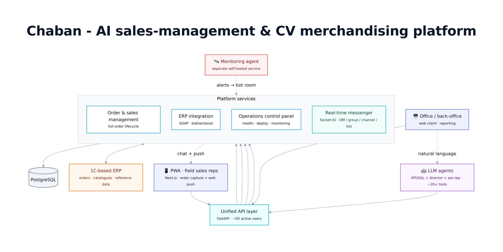
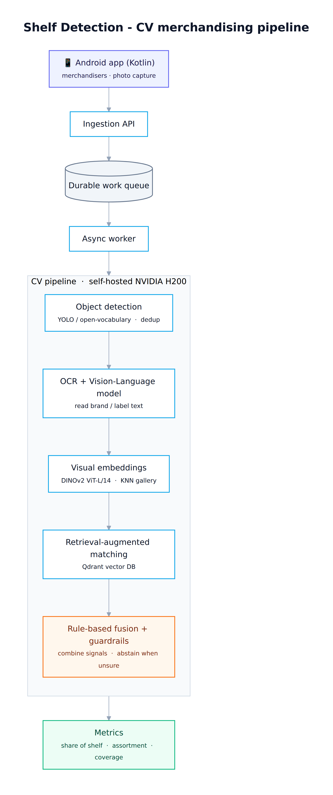
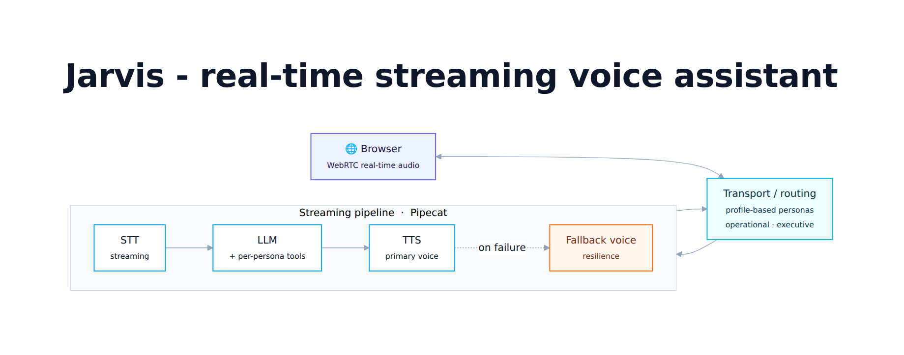

# AI Platform Architect / Full-Stack AI Engineer - Portfolio

I design and ship **production AI systems end-to-end** - from backend architecture,
data modelling and ML pipelines to GPU inference infrastructure, LLM agent layers,
ERP integrations, frontend interfaces, and production operations.

I work as the **sole technical owner** of several AI products: I make the
architectural decisions, write code across the stack, run self-hosted inference
infrastructure, integrate with business systems, and operate the systems in production.

My focus areas are **computer vision pipelines**, **LLM agents / function-calling
systems**, **real-time voice assistants**, **ERP and business-system integrations**,
and **AI-powered product interfaces** - with a strong bias toward measurable results,
honest evaluation, and safe gated rollouts rather than demo-only AI.

> **Note on code access:** most production code is private because these systems
> run inside commercial environments and include business integrations, infrastructure
> details, and proprietary data. This repository contains sanitized case studies,
> architecture notes, metrics, and selected implementation details.

> **What this portfolio shows:** for each project - the problem, the architecture, my role, the
> stack, and concrete results. Infrastructure is described at the level of *technology class*
> (e.g. "self-hosted S3-compatible object storage", "NVIDIA H200 GPU"), not specific deployments.

---

## Table of contents

| Project | One-liner | Deep-dive |
|---|---|---|
| **Chaban** | AI sales-management + CV merchandising platform for a large FMCG / dairy producer | [projects/chaban.md](projects/chaban.md) |
| **Shelf Detection** | Computer-vision merchandising service + mobile app (share-of-shelf analytics) | [projects/shelf-detection.md](projects/shelf-detection.md) |
| **BOOMi** | Beverage brand - 3D web experience, generative video, social Business API integration | [projects/boomi.md](projects/boomi.md) |
| **Jarvis** | Real-time streaming voice assistant (STT → LLM → TTS) | [projects/jarvis.md](projects/jarvis.md) |
| **AIOps Monitoring Agent** | Self-hosted infra watcher with rule-based detectors, LLM responder, and mobile alerts | [projects/infra-monitoring-agent.md](projects/infra-monitoring-agent.md) |
| **Influencer Pipeline** | Micro-influencer discovery & vetting pipeline (data engineering) | [projects/influencer-analytics.md](projects/influencer-analytics.md) |

---

## Chaban - AI Sales-Management & CV Merchandising Platform

**Problem.** A large FMCG / dairy producer ran field sales and merchandising across a wide retail
network on manual, fragmented processes. The goal: digitize order capture, merchandising
compliance, and analytics into one platform that integrates with the company's ERP.

**Architecture.** The platform evolved from an early monolith into a set of modular services
behind a single API layer:
- **Order & sales management** backend (Python / FastAPI, PostgreSQL) covering the full
  order lifecycle.
- **ERP integration** with a 1C-based ERP over **SOAP web services** - bidirectional document
  exchange (orders, catalogues, reference data) with a traceable source-of-truth mapping.
- **Operations control panel** - monitoring, deployment, and health surfacing for the running
  services.
- **LLM agents** - a set of function-calling assistants (an in-platform KPI/SQL agent plus separate
  director and per-rep agents) exposing **~20+ tools in total** over the platform's data and
  operations, so non-technical users can query and act in natural language.
- **Two mobile clients** - an installable **PWA** (Next.js) for field sales reps (order capture +
  web-push alerts) and a **native Android (Kotlin)** app for merchandisers (in-store shelf photo
  capture, feeding the CV pipeline).
- **Real-time messenger** - an in-house **Socket.IO** chat (DM / group / channel / bot / support
  rooms) with presence, attachments, role-based access, and web-push - on both web and mobile. It
  doubles as the delivery channel for agent alerts (bot rooms), e.g. incidents from the monitoring agent.

**My role.** Sole technical owner: system architecture, the full backend, the data model, the
ERP/SOAP integration, the agent/tool layer, and production deployment and operations.

**Stack.** Python, FastAPI, PostgreSQL, SOAP/ERP integration, LLM function-calling, Next.js, PWA,
Kotlin (Android), Socket.IO, Web Push (VAPID), Docker, process-based service orchestration.

**Scale & results.**
- **~2,000 retail outlets** served.
- **500-700 orders/day** flowing through the platform.
- **~50 active users** (field sales + office).
- Replaced manual order entry and spreadsheet reporting with an integrated, ERP-synced flow.

**Operations.** The platform runs under the supervision of a separate self-hosted
**monitoring / alerting agent** that watches services, PM2 processes, GPU, and inference endpoints,
and pushes alerts to a mobile chat - so the system is not just built, but actively operated.
See [AIOps Monitoring Agent](projects/infra-monitoring-agent.md).

→ [Full write-up](projects/chaban.md)

---

## Shelf Detection - Merchandising Computer-Vision Service + Mobile App

**Problem.** Measure on-shelf reality - share of shelf, assortment coverage, competitor presence,
package/format mix - directly from photos taken by field merchandisers, at scale, without manual
tagging.

**Architecture.** A staged, asynchronous CV pipeline:
- **Mobile capture app** (native Android, Kotlin) → ingestion API → durable **work queue** → async worker.
- **Object detection** (YOLO / open-vocabulary detection) to localize product packs on the shelf.
- **OCR + Vision-Language model** pass to read brand/label text from each crop.
- **Visual embeddings** (DINOv2 ViT-L/14) feeding a **KNN gallery** of confirmed products.
- **Retrieval-augmented matching** over a **vector database (Qdrant)** for SKU identification.
- **Rule-based fusion + guardrail layer** that combines OCR, retrieval, and visual signals, and
  deliberately abstains (honest "Unknown") rather than emitting confident-but-wrong labels.
- **Self-hosted GPU inference** on an **NVIDIA H200** for detection, embeddings, OCR, and VLM.

**My role.** Designed and built the entire pipeline: detection integration, the OCR/VLM and
embedding services, the retrieval/matching layer, the guardrail and within-shelf disambiguation
logic, the training/evaluation harness, and the catalog-normalization tooling. I treat the LLM as
a **teacher/auditor** for labeling, never as uncontrolled production inference.

**Stack.** PyTorch, YOLO / open-vocabulary detectors, DINOv2, Vision-Language OCR, Qdrant,
FastAPI, PostgreSQL, self-hosted S3-compatible object storage, Docker.

**Results.**
- Detection **F1 improved 0.68 → 0.91 on unseen (out-of-sample) photos**.
- **Catalog normalization 34 → 20 categories**, removing duplicated/ambiguous classes.
- **Eliminated ~300 false positives** via a targeted regex/normalization fix in the label path.
- Trained package classifier reaching **~92% overall accuracy** with leak-free, grouped-by-image
  evaluation and cross-store stress testing.
- Engineered a **shadow → active rollout discipline** (every model/guardrail change runs in
  shadow and is measured on a real population before it can affect production metrics).

→ [Full write-up](projects/shelf-detection.md)

---

## BOOMi - Beverage Brand: 3D Web, Generative Video, Social Integration

🔗 **Live site:** [boomidrinks.ru](https://boomidrinks.ru)

**Problem.** Launch a consumer beverage brand with a premium digital presence and an automatable
social-media channel.

**Architecture.**
- **Marketing site** - Next.js + React + **React Three Fiber** (real-time 3D product/scene
  rendering in the browser), with a scroll-driven hero and a full brand-identity system
  (palette, typography, motion).
- **Generative video creative** - an image-to-video / text-to-video pipeline used to produce
  cinematic product clips, with a draft-then-final cost discipline.
- **Social Business API integration** - a FastAPI wrapper around a social-media **Business API**
  for programmatic publishing, with token lifecycle handling.
- **Self-hosted media delivery** for brand assets behind TLS.

**My role.** Full-stack build (frontend + backend), the 3D/creative front-end, the generative
video tooling, and the social API integration and deployment.

**Stack.** Next.js, React, React Three Fiber, TypeScript, FastAPI, Python, nginx, generative
video models, static-hosting + TLS.

**Results.** Live production site with an interactive 3D hero and brand system; a working
programmatic social-publishing integration; a repeatable generative-video workflow for brand
creative.

→ [Full write-up](projects/boomi.md)

---

## Jarvis - Real-Time Streaming Voice Assistant

**Problem.** A hands-free operational assistant that feels conversational - low enough latency
for natural back-and-forth, with the platform's tools available by voice.

**Architecture.**
- **Streaming pipeline** built on **Pipecat**: streaming **STT → LLM → TTS**, with a **fallback
  voice** for resilience when the primary TTS is unavailable.
- **WebRTC** transport for real-time audio in the browser.
- **Profile-based prompts and tools** - the same engine serves distinct personas (e.g.
  operational vs. executive) with different system prompts and tool subsets, routed at the
  transport layer.

**My role.** Pipeline integration, persona/profile routing, and **latency / time-to-first-byte
(TTFB) reduction** work across the STT → LLM → TTS path.

**Stack.** Pipecat, WebRTC, streaming STT/TTS, LLM, Python.

**Results.** A working real-time voice assistant with measurable latency/TTFB improvements and
multi-persona routing on a shared pipeline.

→ [Full write-up](projects/jarvis.md)

---

## AIOps Monitoring Agent - Self-Hosted Infra Watcher + LLM Responder

**Problem.** Operating several production AI and business-critical services as a solo technical
owner means failures must be detected fast, explained clearly, and surfaced where they will
actually be seen - across application health, AI inference endpoints, PM2 processes, GPU, remote
hosts, and database/integration signals.

**Architecture.** A hybrid agent that pairs deterministic detectors with an LLM responder:
- **13 independent detectors** - service-down, PM2 crash-loop, memory leak, GPU thermal/VRAM/power,
  disk-full, remote-host unreachable, DB anomaly, ERP (1C) send-failure, OCR empty-rate, and
  security detectors (HTTP brute-force, 429/5xx spikes, SSH brute-force).
- **~22 health-checked endpoints** - 6 APIs, 5 web frontends, 6 AI inference services, object
  storage, vector DB, PostgreSQL/pooler/Redis - plus every PM2 process, GPU, disk, and remote hosts.
- **LLM responder** - backed by a self-hosted **Qwen** model for incident summarization and
  operator-friendly context.
- **Mobile chat alerting** - incidents delivered directly to the operator, not buried in logs.
- **60-second production loop** (cron-driven) with thresholds, consecutive-failure counters, and dedup.

**My role.** Designed and built the monitoring system end-to-end: detector logic, service registry,
LLM responder integration, alert formatting, chat delivery, and production operation.

**Stack.** Python, PM2 monitoring, self-hosted LLM (Qwen), GPU infrastructure monitoring, service
health checks, chat-based alerting, Linux operations.

**Results.**
- **~22 endpoints + full host** watched by **13 detectors** on a **60-second loop** - incidents
  surface within ~1 cycle, not hours later in logs.
- **Threshold-tuned to cut alert fatigue** (e.g. crash-loop at ≥3 restarts/min, service-down after
  ≥3 consecutive checks) with dedup so flapping alerts once.
- **Real incident:** a preview web process crash-looping at **~222 restarts/min** (threshold 3) was
  caught on the next cycle and alerted to mobile chat - an invisible, CPU-burning failure made
  immediately actionable.
- A practical AIOps layer letting **one engineer operate multiple production AI systems**.

→ [Full write-up](projects/infra-monitoring-agent.md)

---

## Influencer Discovery & Vetting Pipeline

**Problem.** Influencer marketing for a regional brand launch is wrecked by inflated follower
counts and fake engagement (bots, engagement pods). The goal: a repeatable, low-cost pipeline that
surfaces genuine **micro-influencers** with real, local audiences and filters out the noise.

**Architecture.** A cheaper-first funnel: hashtag/geo discovery (managed scraping API) → a
profile-metrics filter (follower band ~2k-5k + engagement rate ≥ ~4%) → a **comment-authenticity
analysis** that detects bot/pod activity → a ranked, vetted shortlist with per-candidate HTML
reports.

**My role.** Built the full pipeline end-to-end - staged scraping orchestration, filtering/scoring,
the comment-authenticity stage, reporting, and cost controls.

**Stack.** Python, managed scraping API, engagement-rate analytics, HTML reporting,
cost-budgeted batch orchestration.

**Results.**
- Narrowed **~970 candidates → ~30 qualifying → ~19 vetted** genuine micro-influencers.
- Documented an honest **~3% hit-rate** as a realistic planning input.
- Ran the full discovery → vetting cycle for **~$14** in scraping cost.

→ [Full write-up](projects/influencer-analytics.md)

---

## Infrastructure & Engineering Practices

- **Self-hosted GPU inference** on **NVIDIA H200** - detection, embeddings, OCR, and
  vision-language and language models served locally for cost control and data residency.
- **Self-hosted services** across the stack: relational database (**PostgreSQL**),
  **S3-compatible object storage**, **vector database (Qdrant)**, reverse proxy / TLS,
  process-based service orchestration.
- **Containerization** with Docker for reproducible model/service deployment.
- **Feature flagging & safe rollouts** - a disciplined **shadow → active** model: every model or
  guardrail change runs in shadow, is measured on a real population, and is promoted only behind
  an explicit gate, with one-step rollback always available.
- **Evaluation rigor** - leak-free, grouped-by-image train/test splits; out-of-sample and
  cross-store stress tests; population-level validation (never curated subsets) before any
  production promotion.
- **CI / deploy tooling** - scripted build/deploy, health checks, and process supervision with
  automatic restart and restart-storm guards.
- **Secret hygiene** - identified and remediated committed secrets, migrated credentials to
  environment variables, and established least-privilege, read-only database access for analytics
  and agents.

---

## Tech Stack

**Languages:** Python, TypeScript / JavaScript, SQL.

**ML / CV:** PyTorch, YOLO & open-vocabulary object detection, DINOv2 visual embeddings,
Vision-Language models, OCR, retrieval-augmented generation (RAG), ArcFace metric learning,
classifier training & calibration.

**LLM / Agents:** function-calling / tool-use agent layers, multi-tool orchestration, LLM-as-judge
evaluation, real-time voice (Pipecat, streaming STT/LLM/TTS).

**Backend:** FastAPI, REST APIs, async work queues, SOAP/ERP (1C) integration.

**Data:** PostgreSQL, Qdrant (vector DB), S3-compatible object storage.

**Frontend:** Next.js, React, React Three Fiber, PWA, WebRTC.

**Mobile:** installable PWA (Web Push / VAPID), native Android (Kotlin).

**Real-time:** Socket.IO (chat / presence), WebRTC (voice), Web Push.

**Infra / Ops:** NVIDIA H200 GPU inference, Docker, nginx, process orchestration, feature
flagging, CI/deploy scripting, observability & health monitoring.

---

## Contact

**Eduard Haraev**  
GitHub: [swd07](https://github.com/swd07)  
Email: [haraev87@gmail.com](mailto:haraev87@gmail.com)

> This portfolio describes systems I architected and own as the sole technical engineer.
> Infrastructure details are intentionally generalized to the technology-class level.
