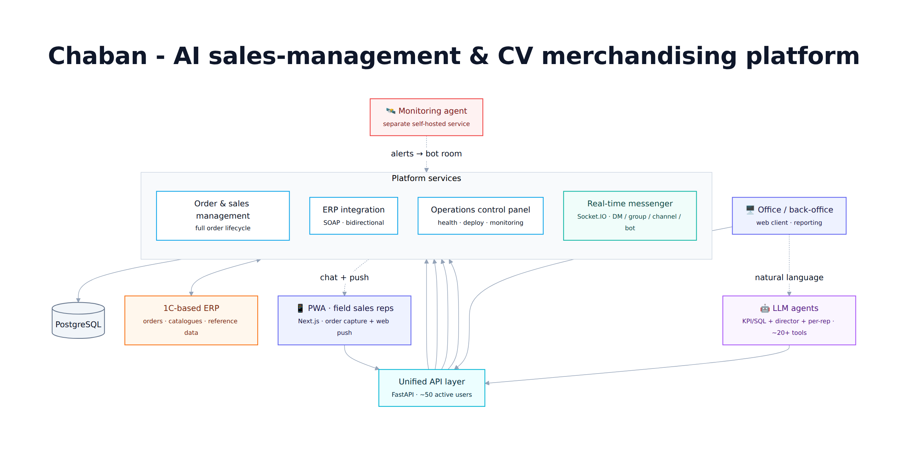
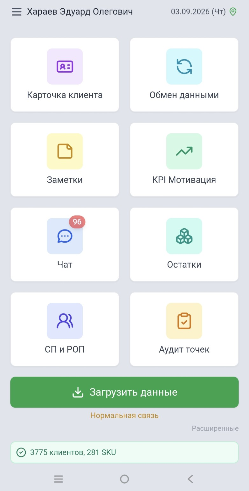

# Applied AI Engineer / AI Solutions Architect — Portfolio

I design and ship **production AI and business systems end-to-end** — from product discovery,
backend/data architecture and enterprise integrations to retrieval/CV pipelines, self-hosted GPU
inference, LLM agents, mobile/web interfaces, evaluation and production operations.

My strongest work sits at the intersection of **Applied AI, product engineering and solutions
architecture**: taking an operational problem, turning it into a system people actually use, and
measuring what works instead of stopping at a demo.

For the main commercial platform below I serve as **Technical Owner / platform architect** and
remain hands-on in architecture, AI, evaluation, integrations and production operations. Other
projects include systems I built independently end-to-end.

> Most production code is private because it contains proprietary data, integrations and
> infrastructure details. This repository contains sanitized case studies, architecture,
> measurable results and selected implementation details.

---

## Featured work

| Project | What it is | Evidence / deep dive |
|---|---|---|
| **AI Chaban2** | Commercial operating platform: offline field sales, 1C ERP, KPI/BI, versioned forecasting/backtesting, merchandising AI and agents | [Portfolio case study](projects/chaban.md) |
| **Beverage Operations & Supply Planning + Action Agent** | Private operational planning platform with stock/supply workflows and an embedded 11-tool self-hosted Qwen action agent | [Case study](projects/operations-supply-planning-agent.md) |
| **Internal Developer Platform & Release Orchestration** | Delivery control plane for repository state, selective promotion, conflict handling, dependency preflight, builds and runtime restart/verification | [Case study](projects/developer-delivery-control-plane.md) |
| **Retail Shelf Detection** | Offline Android field capture + production multimodal retrieval/recognition with Qdrant, DINOv2/ArcFace, guardrails and abstention | **[Technical case-study repository](https://github.com/swd07/retail-shelf-detection)** |
| **AI Marketing & Brand Growth Platform** | Multi-source marketing intelligence: Instagram, website traffic, search visibility, content analytics, influencer workflow and AI-assisted reporting | [Case study](projects/marketing-platform.md) |
| **AI Infrastructure Control Plane & Security Operations** | Self-hosted control plane + deterministic AIOps/security + H200/model observability + Qwen incident assistant + least-privilege MCP access | [Case study](projects/infra-monitoring-agent.md) |
| **Jarvis — Multi-Agent Orchestrator** | Voice-first executive/ops command center: WebRTC, agent registry + command queue, project intelligence, safe browser actions and delegated work | [Case study](projects/jarvis.md) |
| **Fitness Marathon Platform** | 0→1 coach/client product with private media, chat, RBAC and full-stack delivery | [Case study](projects/fitness-platform.md) |

---

## AI Chaban2 — Commercial Operating Platform

A production **field-sales and commercial-operations platform** for an FMCG manufacturer. Its core
is an offline-first working application for field sales reps, integrated bidirectionally with 1C ERP.
On top of the transactional layer sit KPI/motivation, management BI, forecasting, merchandising CV,
self-hosted AI services and operational agents.

**Verified production scale**

- **21 active field reps** and about **1,500 active retail outlets** in a typical month.
- **9–11k company orders/month**; by Aug 2026 **98% of ERP orders carried a platform-generated ID**.
- About **13k GPS-stamped visits/month**; 50k+ field visits recorded.
- **30k+ cash receipts** and **~10k returns** posted through the platform since early 2026.
- **12 KPI/motivation schemes** and a **13-area management BI suite** with role/team scoping.
- **103 GB PostgreSQL / ~278M rows**, plus Redis, Qdrant, object storage and self-hosted GPU services.

**Field-sales product**

The PWA covers the rep's daily route, GPS visit start/end, client card, debt and unpaid invoices,
product catalog, prices/discounts/agreements, stock visibility, order entry, cash receipts, returns,
OOS/shelf-price capture, audits, notes, personal KPI and push reminders.

### Production mobile client

  

*Representative production screen from the field-sales client.*

The screen is a real production interface used in day-to-day field work, not a design mockup. It
exposes routes, clients, sales/orders, cash payments, stock, KPI/motivation, audits, messaging and
device synchronization on top of the same backend and data platform described below.

It is genuinely **local-first**: a Dexie/IndexedDB store prefetches working reference data and a typed
transactional outbox handles orders, receipts, returns and visit/GPS events with backoff, dead-letter
handling, send locks and duplicate controls. **45.8k of 46.5k recorded platform orders were created
offline.**

**ERP / analytics / AI**

- Bidirectional **1C ERP** exchange: 15 inbound document types plus outbound SOAP posting of
  orders, receipts and returns with reconciliation.
- **13 management analytics areas**: sales, plan/fact, service level, receivables aging, returns,
  geographic coverage, client clusters, ABC/XYZ, churn risk, visit coverage and configurable pivot.
- Demand forecasting is a **versioned pipeline**, with Prophet per active SKU, holiday/promotion/
  weather inputs, walk-forward backtesting, WAPE/sMAPE analysis and top-down customer allocation.
  Current audited quality remains weak at **WAPE ~57%**, so it is an improvement area rather than a
  headline result.
- Merchandising combines a native **Kotlin/Compose offline terminal** with Room/WorkManager,
  planogram/shelf-zone workflows and the production CV/retrieval pipeline.
- Self-hosted LLM/tool-calling services sit on the same platform infrastructure.

**Business impact I can prove:** the platform became the company's primary order-entry channel and
made field execution measurable. I do **not** attribute the company's sales growth to the platform:
the growth trend started before platform adoption, and there is no clean baseline for hours/FTE cost
savings.

**My role:** Technical Owner / platform architect and ARB chair; architecture and major technology
decisions, production ownership, AI/retrieval/evaluation work, ERP/infrastructure decisions and
engineering governance, working with the delivery team rather than claiming all platform code as
individual authorship.

→ **[Full Chaban product / architecture case study](projects/chaban.md)**  
→ [Offline merchandising terminal deep dive](projects/merch-terminal.md)

---

## Beverage Operations & Supply Planning + Action Agent

A private operational planning system for a consumer beverage business, combining master data,
supply/stock workflows, planning scenarios and an embedded **self-hosted Qwen action agent**.

The agent is not a generic chatbot. It exposes **11 explicit tools** for two separate classes of work:

- **bounded planning mutations** — automatic/manual supply mode, quantity overrides, actual-stock
  overrides, reset operations and primary-plan selection;
- **structured UI actions** — show/hide metrics, collapse/expand groups, scroll to a domain entity /
  SKU / period and switch planning scenarios.

Names, SKUs, periods and metrics are resolved into canonical domain identifiers before an action is
executed. Ambiguous matches return an error instead of silently choosing one. User identity is
injected by the application boundary rather than trusted from model-generated tool arguments.

The key pattern is:

`free-form intent → explicit domain tool → deterministic application action`

→ **[Full sanitized operations + action-agent case study](projects/operations-supply-planning-agent.md)**

---

## Internal Developer Platform & Release Orchestration

A private **delivery control plane** built around the real multi-environment release workflow rather
than around a generic CI dashboard.

It joins repository and runtime state into one operator surface:

- branch / commit / ahead-behind / working-tree inspection;
- file and branch diff, commit history and comparison;
- commit, pull, push and merge workflows;
- preview → staging → production promotion;
- **selective cherry-pick** when a full branch merge is too broad;
- merge-conflict extraction, resolution and abort paths;
- Python/Node **dependency preflight against the target runtime**;
- frontend build, cache handling, PM2 restart, health and logs;
- self-hosted Qwen assistance for human-readable commit-message suggestions.

The release flow is treated as a state machine with visible failure states instead of a single opaque
“Deploy” button:

`inspect → diff → commit → promote → preflight → build → restart → verify`

→ **[Full internal developer platform / release-engineering case study](projects/developer-delivery-control-plane.md)**

---

## Retail Shelf Detection — Production Retrieval & Multimodal AI

A production-engineered merchandising system that starts in the store, not at the GPU. A native
**Kotlin / Jetpack Compose** terminal persists photo work in **Room**, uses WorkManager for deferred
sync, retries immediately when connectivity returns, recovers interrupted uploads and supports
planogram / shelf-zone editing on-device.

The uploaded shelf photos then become brand/SKU, share-of-shelf, assortment and competitor analytics
through:

`GroundingDINO → Qwen2.5-VL OCR → Qwen3-Embedding → Qdrant retrieval → DINOv2 / ArcFace → deterministic fusion → guardrails → SKU / brand / unknown`

The LLM **does not choose the final SKU**. Independent evidence is fused deterministically, and the
system abstains when confidence is insufficient.

**Key evidence**

- **95.8% brand precision / 73.1% SKU precision** on confirmed end-to-end evaluation.
- **1,345 entries** in the production vector-retrieval catalog; broader merchandising catalog has
  ~1.5k own + competitor SKUs.
- **~320k OCR calls** and **~108k ArcFace shadow evaluations** processed.
- **6k+ shelf photos** processed; current rollout is a **pilot across 40 outlets / 3 merch users**.
- Golden sets, cross-store validation, recall@K, FPR-anchored precision, pre-registered kill gates,
  a **47k-box replay harness**, and `off → shadow → active` rollout.
- Field capture is decoupled from inference through a durable offline queue, so weak connectivity or
  a busy GPU service does not block the merchandiser's next photo.

→ **[Open the authoritative technical case study + runnable examples](https://github.com/swd07/retail-shelf-detection)**  
→ [Offline Android merchandising terminal deep dive](projects/merch-terminal.md)

---

## AI Marketing & Brand Growth Platform

A production **marketing intelligence and brand-growth platform** built around a real consumer
beverage brand. It combines website analytics, Instagram performance, search visibility,
content-level reporting, influencer discovery and AI-assisted campaign analysis in one operational
workflow.

**Representative measured outcomes from the showcased 30-day window**

- **1,068 website visits** — **+88%** vs. the previous comparable period.
- **906 unique visitors** — **+93%**.
- **4,531 Instagram followers** with **+2,859 followers added during the period**.
- **98 Instagram posts** analyzed at content level.
- **247 Google search clicks** from **1,403 impressions**.
- **17.6% Google Search CTR** and **2.4 average search position**.

These are observed platform measurements, not causal attribution of all growth to the software.

### Consumer-facing 3D experience

The same work also included a production **Next.js / React Three Fiber** brand experience with
interactive 3D product presentation and a generative-video workflow.

### Growth & content intelligence

The reporting layer joins website traffic, lead actions and Instagram audience growth into one
period-over-period view.

At content level, the platform tracks format, likes, comments, views, engagement rate and relative
performance to surface which posts actually gain attention.

### Cross-channel reporting

The full platform also includes acquisition-source analysis, device/geography breakdowns and Google
Search Console reporting for clicks, impressions, CTR, average position and branded demand.

→ **[Open the full marketing-platform case study with all production screenshots](projects/marketing-platform.md)**  
→ [BOOMi web / creative layer](projects/boomi.md) · [Social intelligence deep dive](projects/social-media-intelligence.md)

---

## AI Infrastructure Control Plane & Security Operations

A private production **control plane + autonomous AIOps/security layer** for a mixed application and
self-hosted AI environment. The system combines a Next.js operations console, deterministic detectors,
security telemetry, H200/model observability, mobile incident delivery, a tool-calling Qwen assistant
and a separate **least-privilege MCP gateway** for trusted local AI/IDE clients.

**Operational coverage**

- **~22 health-checked endpoints** across APIs, frontends, AI inference and core infrastructure,
  plus PM2 processes, hosts, GPU and database signals.
- **15+ detector / alert types** covering HTTP/SSH security events, service-down/stuck states, PM2
  crash loops, memory/disk/host failures, database anomalies, integration failures and AI-specific
  degradation.
- **60-second autonomous watcher** with consecutive-failure gates, resource-aware deduplication and
  configurable thresholds.
- **10–15 second control-panel refresh** for system health, servers, AI models, services, security,
  logs, databases and operational status.
- NVIDIA **H200** monitoring for VRAM, utilization, temperature, power and active GPU processes.
- **20+ tool** self-hosted Qwen incident assistant that queries real operational data instead of
  inventing system state.
- A separate **7-tool MCP surface** uses PostgreSQL read-only permissions, explicit whitelist,
  input bounds, a default 24 KB output cap, stdio transport and JSONL audit; the wrapper has
  **19 focused security tests**.

Two AI-specific detectors are especially important: **LLM endpoint drift** catches live model
endpoints that no longer match configured inventory after migrations, while **silent OCR degradation**
can detect quality collapse even when the OCR service itself remains technically online. New quality
detectors can run in **shadow mode** before they are allowed to notify operators.

**Production evidence:** the security/infra watcher recorded **152 alerts in Aug 2026**. In one real
incident a preview process entered a restart storm at roughly **222 restarts/minute**; the crash-loop
detector surfaced it on the next monitoring cycle.

→ **[Full sanitized control-plane / security operations case study](projects/infra-monitoring-agent.md)**

---

## Jarvis — Voice-First Multi-Agent Orchestrator

Jarvis evolved from a low-latency streaming voice assistant into a **human-to-agent orchestration
layer** for the production platform. The browser voice loop is still real-time
`WebRTC → VAD/SmartTurn → Whisper → LLM → streaming TTS`, but the important layer now sits behind it.

Jarvis maintains an **agent registry with heartbeat, current-task and queue state**, and can delegate
allowlisted work through a persistent command lifecycle:

`pending → accepted → running → done | error | cancelled`

The voice assistant can ask specialized agents for operations/service health, deployment and log
summaries, or for executive information such as portfolio status, risks, deadlines, blockers and
project details. It checks whether an agent is live before dispatch and summarizes the returned result
instead of exposing raw tool payloads.

A separate director profile deliberately receives business/project tools rather than infrastructure
control, while the admin profile can access operational capabilities. Jarvis can also **open approved
pages and dashboards by voice** through a named-target allowlist rather than allowing arbitrary URLs.

The Command Center HUD brings together the **agent fleet, project inventory, infrastructure/GPU
telemetry, live activity and conversational state** on one screen.

→ **[Full multi-agent orchestration + voice command-center case study](projects/jarvis.md)**

---

## Fitness Marathon Platform — 0→1 Product

Next.js 15 + Payload CMS 3 + PostgreSQL coach/client platform for cohort-based fitness programs.
Built as an app-like product with trainer/client flows, private signed media, RBAC, group/direct
chat, review workflows and domain invariants in the data layer.

**Evidence:** 21 collections, 7 vertical delivery slices and **204 automated tests**, including IDOR,
CSRF, file-isolation and trainer-scope security coverage.

→ [Full write-up](projects/fitness-platform.md)

---

## Additional brand / creative engineering

### BOOMi — Consumer Web & Generative Media

Consumer-brand work spanning a **React Three Fiber / Next.js 3D web experience**, generative-video
workflow and social publishing integration.

→ [BOOMi case study](projects/boomi.md)

### Social Media Intelligence

Influencer discovery, authenticity filtering, Instagram Business API operations and multi-source
campaign analytics used as part of the broader marketing platform.

→ [Social Media Intelligence case study](projects/social-media-intelligence.md)

---

## Engineering strengths

- **Product / architecture:** discovery, 0→1 delivery, enterprise integration, offline/mobile/web
  workflows, production ownership and technical governance.
- **Applied AI:** multimodal retrieval, computer vision, OCR/VLM, vector search, LLM agents,
  tool calling, multi-agent orchestration, self-hosted inference and real-time voice.
- **Agentic business systems:** bounded domain tools, server-owned identity context, structured UI
  actions and operational agents embedded directly into business workflows.
- **Developer platform / release engineering:** repository-state modeling, selective promotion,
  dependency preflight, conflict handling, build/restart orchestration and recovery workflows.
- **AI infrastructure / operations:** control-plane design, GPU/model observability, deterministic
  detectors, security telemetry, incident response, **least-privilege MCP access** and AI-aware
  degradation monitoring.
- **Evaluation:** golden sets, grouped/cross-store validation, recall@K, FPR-anchored precision,
  replay testing, walk-forward forecast backtesting, WAPE/sMAPE, pre-registered acceptance/kill
  thresholds and explicit abstention.
- **Safe rollout:** `off → shadow → active`, observability, health checks, rollback and incident
  monitoring.
- **Data / integration:** PostgreSQL, Qdrant, Redis, MinIO/S3-compatible storage, 1C SOAP/JSON,
  Instagram Business API, Yandex Metrika and Google Search Console.
- **Growth / content systems:** multi-source marketing analytics, content-performance intelligence,
  generative-media workflows and programmatic publishing.

## Tech stack

**AI / ML:** PyTorch · GroundingDINO · DINOv2 · ArcFace · Qwen2.5-VL · Qwen3-Embedding · vLLM · Qdrant · Prophet · Whisper  
**Backend / Data:** Python · FastAPI · PostgreSQL · Redis · MinIO · REST · SOAP / 1C  
**Frontend / Mobile:** TypeScript · Next.js · React · PWA · Dexie/IndexedDB · Kotlin · Jetpack Compose · Room · WorkManager  
**Realtime / Infra:** Socket.IO · WebRTC · MCP · agent registry / command queues · Git release orchestration · PM2/systemd · Docker · nginx · NVIDIA H200 · Prometheus/Grafana · security telemetry · AIOps  
**Marketing / Growth:** Instagram Business / Graph API · Google Search Console · Yandex Metrika · Apify · generative video

---

## Contact

**Eduard Kharaev**  
GitHub: [swd07](https://github.com/swd07)  
Email: [haraev87@gmail.com](mailto:haraev87@gmail.com)  
Telegram: [@Edharaev](https://t.me/Edharaev)