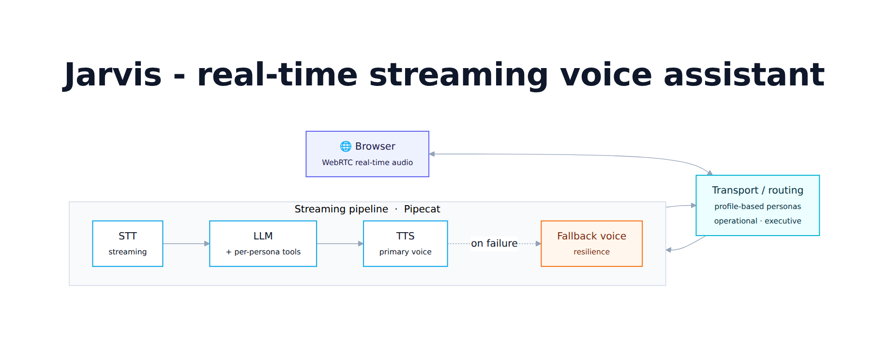

# Applied AI Engineer / AI Solutions Architect - Portfolio

I design and ship **production AI systems end-to-end** - from backend architecture,
data modelling and ML pipelines to GPU inference infrastructure, LLM agent layers,
ERP integrations, frontend interfaces, and production operations.

I work as the **sole technical owner** of several AI products: I make the
architectural decisions, write code across the stack, run self-hosted inference
infrastructure, integrate with business systems, and operate the systems in production.

My focus areas are **production retrieval and multimodal AI systems**, **computer vision pipelines**,
**LLM agents / function-calling systems**, **real-time voice assistants**, **ERP and business-system
integrations**, and **AI-powered product interfaces** - with a strong bias toward measurable results,
honest evaluation, explainable decisions, and safe gated rollouts rather than demo-only AI.

> **Note on code access:** most production code is private because these systems
> run inside commercial environments and include business integrations, infrastructure
> details, and proprietary data. This repository contains sanitized case studies,
> architecture notes, metrics, and selected implementation details.

> **What this portfolio shows:** for each project - the problem, the architecture, my role, the
> stack, and concrete results. Infrastructure is described at the level of *technology class*
> (e.g. "self-hosted S3-compatible object storage", "NVIDIA H200 GPU"), not specific deployments.

---

## What it looks like in production

*One real shelf photo through the production retrieval + CV pipeline: localized packs, brand/SKU labels, price-tag reads — and explicit `unknown` where evidence is insufficient (abstaining beats a confident wrong answer). Details: [Shelf Detection deep-dive](projects/shelf-detection.md).*

## Table of contents

| Project | One-liner | Deep-dive |
|---|---|---|
| **Chaban** | The commercial operating system of a large FMCG producer - orders, CV merchandising, BI/KPI, agents; ~2,000 outlets, 500-700 orders/day | [projects/chaban.md](projects/chaban.md) |
| **Shelf Detection** | Production retrieval + multimodal shelf intelligence: Qdrant dense retrieval, DINOv2/ArcFace visual matching, explainable fusion and guardrails | [projects/shelf-detection.md](projects/shelf-detection.md) |
| **BOOMi** | Beverage brand - 3D web experience, generative video, social Business API integration | [projects/boomi.md](projects/boomi.md) |
| **Jarvis** | Real-time streaming voice assistant (STT → LLM → TTS) | [projects/jarvis.md](projects/jarvis.md) |
| **AIOps Monitoring Agent** | Self-hosted infra watcher with rule-based detectors, LLM responder, and mobile alerts | [projects/infra-monitoring-agent.md](projects/infra-monitoring-agent.md) |
| **Social Media Intelligence** | Influencer discovery + Instagram/Graph API + campaign analytics (Metrika, GSC) | [projects/social-media-intelligence.md](projects/social-media-intelligence.md) |
| **Fitness Marathon Platform** | Coach/client platform for cohort-based fitness marathons (Next.js + Payload CMS) | [projects/fitness-platform.md](projects/fitness-platform.md) |

---

## Chaban — Commercial Operating System for FMCG

A single production platform used daily by field sales representatives,
merchandisers, supervisors, managers, analysts, operations, and leadership.

**Business impact**

- ~2,000 retail outlets and 500–700 orders/day connected directly to the 1C ERP.
- Replaced paper, calls, spreadsheets, and disconnected reporting with one ERP-synced source of truth.
- Field teams manage orders, clients, stock, debt, returns, KPI, and communication online and offline.
- Managers and leadership see company-wide BI, plan/fact, forecasting, sales, debt, returns, and execution in real time.
- LLM agents with 20+ typed tools let non-technical users query data and trigger operational actions in natural language.

**My role:** sole technical owner — architecture, backend, data model, ERP integration,
mobile and web products, agents, deployment, and production operations.

→ [Full architecture, role surfaces, and engineering details](projects/chaban.md)

---

## Shelf Detection - Production Retrieval & Multimodal Shelf Intelligence

**Problem.** Turn field-merchandiser shelf photos into reliable share-of-shelf, assortment,
competitor and SKU analytics. The production catalog contains **1,345 SKUs** across own and
competitor brands, including visually similar siblings that differ only by weight, fat percentage,
flavour or package format. A wrong confident own-vs-competitor decision is worse than returning
`unknown`, so the pipeline is designed to abstain when evidence is insufficient.

**Production architecture.** A staged, asynchronous, fully self-hosted pipeline:
- **Mobile capture app** (native Android, Kotlin) → ingestion API → durable work queue → async worker.
- **GroundingDINO** localizes product packs.
- **Qwen2.5-VL-72B** reads OCR text and package evidence.
- OCR text is embedded by self-hosted **Qwen3-Embedding-8B** (4096-d normalized embeddings).
- **Qdrant** performs cosine dense retrieval over the 1,345-SKU catalog at **top-20**.
- An **attribute-aware reranker** uses weight, fat percentage, category and brand evidence.
- **DINOv2 ViT-L/14** performs visual k-NN against ~18.9k confirmed crops.
- A fine-tuned **ArcFace** metric-learning encoder adds an independent visual vote over ~9.1k references.
- A deterministic **fusion + guardrail layer** combines retrieval, OCR and visual evidence and
  deliberately falls back to `unknown` rather than forcing a low-confidence match.

The LLM **does not select the final SKU**. It reads text/package evidence; final identity is decided
by an explainable pipeline with stored scores, thresholds and decision paths.

**Evaluation & rollout.** Retrieval/model changes are treated as production changes, not notebook
experiments:
- stratified human-labelled golden sets and cross-store validation;
- recall@1 / recall@5 and FPR-anchored precision for retrieval models;
- pre-registered acceptance / kill thresholds with Wilson confidence intervals;
- a **47k-box production replay harness** importing the actual production decision module;
- every candidate layer ships **off → shadow → active** and can be killed before affecting users.

**Results.**
- **Brand precision: 95.8%** on confirmed end-to-end evaluation.
- **SKU precision: 73.1% end-to-end**, versus ~29% for bare retrieval alone.
- Fine-tuned ArcFace cross-store **Recall@1: 84.1%**, versus 26.4% for the DINOv2 baseline in the same evaluation setup.
- ~**320k OCR calls** processed and ~**108k shadow evaluations** recorded in the production system.
- Multiple reranker / encoder candidates were rejected by pre-defined evaluation gates before production rollout.

**My role.** Designed and built the retrieval/matching architecture, OCR/VLM and embedding services,
multimodal fusion and guardrails, training/evaluation harness, catalog-normalization tooling and
production rollout discipline.

**Stack.** Python, FastAPI, PyTorch, GroundingDINO, Qwen2.5-VL-72B, Qwen3-Embedding-8B,
Qdrant, DINOv2, ArcFace, PostgreSQL, self-hosted S3-compatible object storage, Docker,
NVIDIA H200 inference.

> **Terminology note:** this is a production retrieval-augmented recognition system, not a classic
> document-RAG chatbot. Retrieved catalog candidates feed an explainable matching pipeline; the LLM
> does not generate a final answer from retrieved documents.

→ [Full production retrieval / multimodal AI deep-dive](projects/shelf-detection.md)
→ [Public case study + runnable examples](https://github.com/swd07/retail-shelf-detection)

---

## BOOMi - Beverage Brand: 3D Web, Generative Video, Social Integration

🔗 **Live demo available on request.**

**Problem.** Launch a consumer beverage brand with a premium digital presence and an automatable
social-media channel.

**Architecture.**
- **Marketing site** - Next.js + React + **React Three Fiber** (real-time 3D product/scene
  rendering in the browser), with a scroll-driven hero and a full brand-identity system
  (palette, typography, motion).
- **Generative video creative** - an image-to-video / text-to-video pipeline used to produce
  cinematic product clips, with a draft-then-final cost discipline.
- **Social publishing** - programmatic Instagram publishing via the Business/Graph API (token
  lifecycle handled). Social intelligence and campaign analytics are covered in
  [Social Media Intelligence](projects/social-media-intelligence.md).
- **Self-hosted media delivery** for brand assets behind TLS.

**My role.** Full-stack build (frontend + backend), the 3D/creative front-end, the generative
video tooling, and the social API integration and deployment.

**Stack.** Next.js, React, React Three Fiber, TypeScript, FastAPI, Python, nginx, generative
video models, static-hosting + TLS.

**Results.** Live production site with an interactive 3D hero and brand system; a working
programmatic social-publishing integration; a repeatable generative-video workflow for brand
creative.

→ [Full write-up](projects/boomi.md)

---

## Jarvis - Real-Time Streaming Voice Assistant

**Problem.** A hands-free operational assistant that feels conversational - low enough latency
for natural back-and-forth, with the platform's tools available by voice.

**Architecture.**
- **Streaming pipeline** built on **Pipecat**: streaming **STT → LLM → TTS**, with a **fallback
  voice** for resilience when the primary TTS is unavailable.
- **WebRTC** transport for real-time audio in the browser.
- **Profile-based prompts and tools** - the same engine serves distinct personas (e.g.
  operational vs. executive) with different system prompts and tool subsets, routed at the
  transport layer.

**My role.** Pipeline integration, persona/profile routing, and **latency / time-to-first-byte
(TTFB) reduction** work across the STT → LLM → TTS path.

**Stack.** Pipecat, WebRTC, streaming STT/TTS, LLM, Python.

**Results.** A working real-time voice assistant with measurable latency/TTFB improvements and
multi-persona routing on a shared pipeline.

→ [Full write-up](projects/jarvis.md)

---

## AIOps Monitoring Agent - Self-Hosted Infra Watcher + LLM Responder

**Problem.** Operating several production AI and business-critical services as a solo technical
owner means failures must be detected fast, explained clearly, and surfaced where they will
actually be seen - across application health, AI inference endpoints, PM2 processes, GPU, remote
hosts, and database/integration signals.

**Architecture.** A hybrid agent that pairs deterministic detectors with an LLM responder:
- **13 independent detectors** - service-down, PM2 crash-loop, memory leak, GPU thermal/VRAM/power,
  disk-full, remote-host unreachable, DB anomaly, ERP (1C) send-failure, OCR empty-rate, and
  security detectors (HTTP brute-force, 429/5xx spikes, SSH brute-force).
- **~22 health-checked endpoints** - 6 APIs, 5 web frontends, 6 AI inference services, object
  storage, vector DB, PostgreSQL/pooler/Redis - plus every PM2 process, GPU, disk, and remote hosts.
- **LLM responder** - backed by a self-hosted **Qwen** model for incident summarization and
  operator-friendly context.
- **Mobile chat alerting** - incidents delivered directly to the operator, not buried in logs.
- **60-second production loop** (cron-driven) with thresholds, consecutive-failure counters, and dedup.

**My role.** Designed and built the monitoring system end-to-end: detector logic, service registry,
LLM responder integration, alert formatting, chat delivery, and production operation.

**Stack.** Python, PM2 monitoring, self-hosted LLM (Qwen), GPU infrastructure monitoring, service
health checks, chat-based alerting, Linux operations.

**Results.**
- **~22 endpoints + full host** watched by **13 detectors** on a **60-second loop** - incidents
  surface within ~1 cycle, not hours later in logs.
- **Threshold-tuned to cut alert fatigue** (e.g. crash-loop at ≥3 restarts/min, service-down after
  ≥3 consecutive checks) with dedup so flapping alerts once.
- **Real incident:** a preview web process crash-looping at **~222 restarts/min** (threshold 3) was
  caught on the next cycle and alerted to mobile chat - an invisible, CPU-burning failure made
  immediately actionable.
- A practical AIOps layer letting **one engineer operate multiple production AI systems**.

→ [Full write-up](projects/infra-monitoring-agent.md)

---

## AI-Assisted Social Media Intelligence & Campaign Analytics

**Problem.** A regional consumer-brand launch needed more than social-media activity: discover
genuine local micro-influencers, filter out inflated followers and fake engagement, and connect
campaign activity to real signals - website traffic, search visibility, and Instagram growth -
instead of vanity metrics.

**Architecture.** A workflow across three connected layers:
- **Influencer discovery & vetting** - regional hashtag/geo seeding → follower-band + engagement
  filter → comment-authenticity analysis (bot/pod detection) → ranked, vetted shortlist with
  per-candidate reports.
- **Instagram Business/Graph API** - brand-account operations: Reels publishing
  (container → poll → publish), comment replies, and account-metric collection (followers, media).
- **Campaign analytics & reporting** - Yandex Metrika (traffic, sources, devices, age, conversion
  goals), Google Search Console (clicks, impressions, CTR, position, branded vs. non-branded),
  Instagram follower growth, period-over-period comparison, and rolling-window spike detection.

**My role.** Built the data-collection and analytics workflow end-to-end: discovery, Apify-based
extraction, Instagram API operations, website/search metric aggregation, campaign reporting logic,
and AI-assisted analysis. (The full BOOMi internal platform is a separate product; this case study
is the social-intelligence and analytics layer I built around the brand's marketing activity.)

**Stack.** Python, Apify, Instagram Business/Graph API, Yandex Metrika API, Google Search Console
API, marketing analytics, campaign reporting, AI-assisted analysis.

**Results.**
- Narrowed **~970 candidates → ~30 qualifying → ~19 vetted** genuine micro-influencers at low
  scraping cost, with an honest hit-rate documented as a realistic planning input.
- Structured multi-source reporting (traffic, search visibility, Instagram growth, campaign-period
  comparison) connecting brand-promotion activity to measurable audience signals.

→ [Full write-up](projects/social-media-intelligence.md)

---

## Infrastructure & Engineering Practices

- **Self-hosted GPU inference** on **NVIDIA H200** - detection, embeddings, OCR, and
  vision-language and language models served locally for cost control and data residency.
- **Production vector retrieval** - self-hosted Qwen embedding service + Qdrant dense search,
  explicit confidence thresholds, attribute reranking, explainable fusion and abstention.
- **Retrieval/model evaluation** - cross-store splits, recall@K, FPR-anchored precision,
  stratified golden sets, pre-registered kill thresholds and production replay testing.
- **Self-hosted services** across the stack: relational database (**PostgreSQL**),
  **S3-compatible object storage**, **vector database (Qdrant)**, reverse proxy / TLS,
  process-based service orchestration.
- **Containerization** with Docker for reproducible model/service deployment.
- **Feature flagging & safe rollouts** - a disciplined **shadow → active** model: every model or
  guardrail change runs in shadow, is measured on a real population, and is promoted only behind
  an explicit gate, with one-step rollback always available.
- **Evaluation rigor** - leak-free, grouped-by-image train/test splits; out-of-sample and
  cross-store stress tests; population-level validation (never curated subsets) before any
  production promotion.
- **CI / deploy tooling** - scripted build/deploy, health checks, and process supervision with
  automatic restart and restart-storm guards.
- **Secret hygiene** - identified and remediated committed secrets, migrated credentials to
  environment variables, and established least-privilege, read-only database access for analytics
  and agents.

---

## Fitness Marathon Platform - Coach/Client Coaching System

**Problem.** A fitness coach runs women's online marathons (nutrition + home workouts) through
messengers and spreadsheets. Goal: one platform - the coach publishes daily meal plans and
workout programs and reviews photo food reports; participants get an app-like daily flow with
weight, progress photos, chat, and activity tracking.

**Architecture.** Next.js 15 with **Payload CMS 3 embedded natively** (one process, no separate
backend), PostgreSQL, 21 collections. Cohort model: program -> cohort -> calorie groups ->
enrollments; one shared daily menu with **per-calorie-tier portions**. **Private file layer**
(HMAC-signed expiring URLs, per-collection RBAC, EXIF strip) for food reports and progress
photos; membership-based group/direct chat auto-provisioned by enrollment hooks; group-scoped
trainer cabinet with review workflow.

**My role.** Sole engineer end-to-end; delivered in **7 vertical slices**, each through an
external review gate.

**Stack.** Next.js 15, Payload CMS 3, TypeScript (strict), PostgreSQL, Tailwind, Vitest,
Playwright, Docker.

**Scale & results.**
- Complete two-circuit prototype, accepted by a scripted end-to-end walkthrough.
- **204 automated tests** (170 unit/integration x2 runs + 34 e2e), including dedicated security
  suites (IDOR, CSRF, file-access isolation, trainer scope).
- Domain invariants enforced in the data layer (hooks + partial unique indexes), not the UI.

-> [Full write-up](projects/fitness-platform.md)

---

## Tech Stack

**Languages:** Python, TypeScript / JavaScript, SQL.

**ML / CV:** PyTorch, YOLO & open-vocabulary object detection, GroundingDINO,
DINOv2 visual embeddings, Vision-Language models, OCR, ArcFace metric learning,
classifier training & calibration.

**Retrieval:** Qwen3-Embedding-8B, dense vector retrieval, Qdrant, cosine similarity,
attribute-aware reranking, visual k-NN, recall@K evaluation, confidence gating.

**LLM / Agents:** Qwen / vLLM, OpenAI-compatible APIs, function-calling / tool-use agent layers,
multi-tool orchestration, LLM-as-judge evaluation, real-time voice (Pipecat, streaming STT/LLM/TTS).

**Backend:** FastAPI, REST APIs, async work queues, SOAP/ERP (1C) integration, Payload CMS 3.

**Data:** PostgreSQL, Qdrant (vector DB), S3-compatible object storage.

**Frontend:** Next.js, React, Tailwind, React Three Fiber, PWA, WebRTC.

**Mobile:** installable PWA (Web Push / VAPID), native Android (Kotlin).

**Real-time:** Socket.IO (chat / presence), WebRTC (voice), Web Push.

**Infra / Ops:** NVIDIA H200 GPU inference, Docker, nginx, process orchestration, feature
flagging, CI/deploy scripting, observability & health monitoring.

---

## Contact

**Eduard Kharaev**  
GitHub: [swd07](https://github.com/swd07)  
Email: [haraev87@gmail.com](mailto:haraev87@gmail.com)

> This portfolio describes systems I architected and own as the sole technical engineer.
> Infrastructure details are intentionally generalized to the technology-class level.