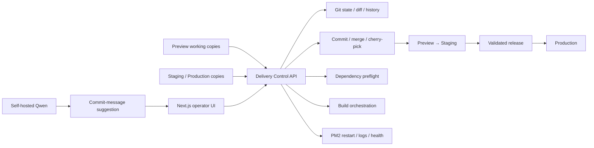

# Internal Developer Platform & Release Orchestration

> A private delivery control plane for managing multi-environment application releases — combining
> repository state, diff/commit workflows, preview → staging → production promotion, selective
> cherry-pick, build/restart orchestration, conflict handling, dependency checks and operational logs.

> **Public case-study note:** production repositories, hostnames, filesystem paths, credentials and
> company-specific deployment topology are intentionally removed. The implementation remains private.

## Problem

A growing internal platform was being developed through several parallel environments. The release
workflow included multiple working copies, preview branches, staging, production, frontend builds,
process restarts and manual Git operations.

The technical problem was not simply “run `git pull` from a UI”. The real problem was preserving a
repeatable delivery path while making the current state visible before a risky operation:

- which branch and commit is actually running;
- whether a working copy is ahead or behind its remote;
- what changed relative to staging or production;
- which files are uncommitted;
- which commits should be promoted;
- whether a build will need dependencies that are missing on the target;
- whether a merge produced conflicts;
- whether the application restarted successfully after deployment.

The goal was to build an **operator-oriented delivery control plane** that reduced routine terminal
work without hiding the underlying Git state.

## What I built

### 1. Repository & environment state

The control plane maintains a configured inventory of production, staging, preview and standalone
repositories. For each working copy it can surface:

- current branch and latest commit;
- ahead / behind state against the tracked remote;
- preview divergence from staging and production;
- uncommitted-file count and detailed working-tree changes;
- PM2 process state;
- lightweight HTTP health state for configured services.

Remote refs are refreshed before important comparisons so the UI does not calculate release state
against a stale local `origin/*` reference.

### 2. Git workflow through the control plane

The backend wraps the Git operations needed for the actual delivery workflow:

- pull and push;
- commit selected files or the full working tree;
- branch-to-branch merge;
- preview → staging promotion;
- staging → production promotion;
- repository and file-level diff inspection;
- commit history and commit-to-HEAD comparison;
- discard/reset operations for recovery.

The UI therefore acts as a **release workspace**, not just a deployment button.

### 3. Selective promotion with cherry-pick

A full branch merge is not always the right production release unit. The platform can list commits
present in a source environment but absent from the target and promote an explicit subset.

The promotion path is roughly:

`preview commit(s) → staging → validated build → production`

Selected commit hashes are validated, ordered, cherry-picked one by one and pushed to the target
branch. Empty/already-present changes are handled separately from real conflicts, while a failed
pick stops the transfer instead of silently continuing with an incomplete release.

This makes it possible to ship one approved change without dragging every unrelated preview change
with it.

### 4. Merge-conflict workflow

When a merge fails, the backend detects unmerged files and extracts conflict information rather than
returning only a generic Git error.

The workflow supports:

- detecting an active merge;
- listing conflicting files;
- extracting `ours` / `theirs` content and conflict blocks;
- choosing a side for a file;
- completing the merge after resolution;
- aborting the merge if the operator decides not to continue.

The important design decision is that **a failed merge becomes an explicit state in the control
plane**, not an invisible terminal problem that leaves the repository half-finished.

### 5. Build, restart & deployment orchestration

Release operations also understand the application runtime.

The platform can:

- run frontend production builds;
- optionally clear framework build cache;
- distinguish development and production frontend processes;
- restart full services or frontend-only PM2 processes;
- run pull/merge → build → restart as a single deployment workflow;
- expose PM2 logs for post-deploy diagnosis.

Build timeouts are deliberately long enough for real production builds rather than assuming that a
web application will compile in a few seconds.

### 6. Dependency preflight

One subtle failure mode is a release whose source code is valid but whose target environment is
missing a required package.

Before promotion, the backend can compare incoming application dependencies with the target runtime:

- Python requirements are checked against the target virtual environment;
- imports in changed frontend files are checked against installed Node packages;
- missing dependencies are surfaced before deployment;
- an explicit installation path can resolve the missing set and re-run the check.

This turns “production build failed because a package was missing” into a detectable pre-deploy
condition.

### 7. AI-assisted commit messages

The panel also integrates a self-hosted Qwen model for one narrow developer-experience task: generate
a human-readable commit message from the current diff.

The model receives repository status and a bounded diff and is prompted to describe **what changed
from the user's point of view**, avoiding implementation jargon where possible. The generated text is
only a suggestion; the actual Git operation remains an explicit control-plane action.

## Architecture

## Safety & failure handling

This type of tool is powerful because it sits directly on the delivery path, so the implementation
makes operational state explicit instead of assuming every command succeeds.

Examples:

- repositories are selected from configured inventory rather than arbitrary filesystem input;
- remote refs are refreshed before divergence checks;
- commit hashes used in selective transfer are format-validated and verified as real commits;
- merge and cherry-pick conflicts stop the workflow;
- partially completed operations can be aborted/recovered;
- build failure prevents the following restart stage from being reported as a successful deployment;
- dependency checks run against the target environment, not only the developer machine.

The system deliberately does **not** try to replace Git. It provides a controlled operational surface
on top of Git, with the underlying state still visible to the operator.

## Why this is more than a DevOps dashboard

A dashboard tells you that a repository exists or that a process is online. This system performs the
actual delivery workflow while preserving intermediate states:

`inspect → diff → commit → promote → preflight → build → restart → verify`

It connects software-development state to runtime state, which is the reason I treat it as an
**internal developer platform / delivery control plane** rather than a monitoring UI.

## My role

Designed and built the internal workflow and backend orchestration, including repository-state
modeling, Git operations, environment comparisons, selective promotion, merge-conflict handling,
dependency preflight, build/restart automation, operational recovery paths and the AI-assisted commit
message workflow. The operator frontend is a private Next.js application connected to the same API.

## Stack

`Python` · `FastAPI` · `Git` · `subprocess` · `Next.js` · `TypeScript` · `React` · `PM2` · `Linux`  
`npm / Node.js` · `Python virtualenv / pip` · `HTTP health checks` · `self-hosted Qwen`

## Engineering principles demonstrated

- **State before action:** show branch, diff and divergence before promotion.
- **Small release units:** selective cherry-pick when a full branch merge is too broad.
- **Failure as state:** conflicts and build failures are first-class workflow states.
- **Target-aware preflight:** validate the environment that will actually run the release.
- **Recovery paths:** abort, reset and discard workflows are part of delivery engineering.
- **AI as assistance, not authority:** the model can draft a commit message; Git state remains
  deterministic and operator-controlled.
