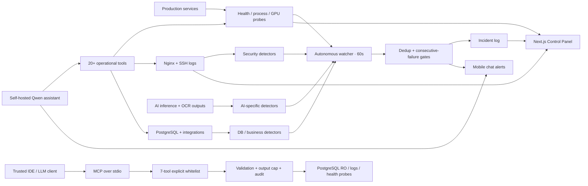

# AI Infrastructure Control Plane & Security Operations

> A self-hosted operations layer for production AI infrastructure — combining a web control plane,
> deterministic AIOps/security detectors, AI-model and GPU observability, incident alerting, a
> tool-calling Qwen assistant, and a least-privilege MCP gateway for safe external AI access.

> **Public case-study note:** the production repositories remain private. Internal IPs, usernames,
> credentials, hostnames and company-specific infrastructure details are intentionally removed here.

## Problem

Operating a growing production AI stack created a problem that ordinary uptime checks did not solve.
The environment included application APIs, web frontends, background workers, databases, object and
vector storage, GPU inference services, business integrations and multiple AI models. A failure could
look very different depending on the layer:

- a process can be `online` but stuck;
- an inference endpoint can time out because it is busy rather than dead;
- a model can move to a new port while stale configuration still points at the old endpoint;
- OCR can remain technically available while silently returning empty results;
- a broken deploy can create a PM2 restart storm;
- authentication traffic can turn into brute-force or rate-limit abuse;
- an ERP integration can fail while the application itself still looks healthy.

A second problem appeared once AI clients were allowed to inspect operations: **how do you expose useful
production telemetry to an LLM without exposing every internal tool, secret, identity or database
operation?**

The goal became broader than monitoring: build a **single operational control layer** that helps one
technical owner understand what is running, detect failures early, investigate them with real data,
and expose only narrowly bounded operational capabilities to AI clients.

## What I built

The system has five cooperating layers.

### 1. Operations Control Panel

A private **Next.js / TypeScript control plane** for day-to-day operation of the production stack.
It provides dedicated views for:

- system health and service latency;
- servers, CPU/RAM/disk and remote-host availability;
- PM2 processes and restart state;
- AI models, inference services and their consumers;
- NVIDIA H200 VRAM, utilization, temperature, power and GPU processes;
- databases, logs and network state;
- deployment/project inventory and environment status;
- security telemetry, sessions and audit information;
- operational monitoring for field applications.

The main dashboards refresh on roughly **10–15 second intervals**, while service maintenance state
can be explicitly marked so planned work is not treated as an incident.

### 2. Autonomous Security / AIOps Watcher

A Python watcher runs on a **60-second production loop** and evaluates deterministic detectors before
anything reaches the LLM layer.

Current detector coverage includes **15+ operational/security alert types** across:

**Security**
- HTTP authentication brute-force patterns;
- rate-limit / HTTP 429 spikes;
- HTTP 5xx spikes;
- SSH failed-login / brute-force patterns.

**Application & infrastructure**
- service-down after consecutive failures;
- `busy` vs `stuck` service triage;
- PM2 crash-loop / restart-rate spikes;
- abnormal process memory use;
- disk pressure;
- remote-host unreachability;
- PostgreSQL health and query/session anomalies;
- business-integration send failures.

**AI infrastructure**
- GPU thermal, VRAM and sustained-power anomalies;
- **LLM endpoint drift** — detect a live OpenAI-compatible model endpoint that is missing from the
  configured inventory;
- **silent OCR degradation** — detect when the service stays online but fresh merchandising analyses
  suddenly contain an abnormal share of empty OCR results.

### 3. Security Monitor

The control plane includes a live security console that joins web and host telemetry into one view:

- requests, unique IPs, 4xx/5xx/429 rates;
- password brute-force candidates with severity;
- recent SSH accepted/failed events;
- top source IPs;
- live request feed with user/device enrichment;
- response times and HTTP status;
- secret-leak registry with severity and remediation status;
- watcher / incident-bot health.

This gives the operator a fast path from **alert → evidence → affected resource** without starting
with SSH and manual log tailing.

### 4. Tool-calling Qwen Incident Assistant

A self-hosted **Qwen** assistant sits next to the deterministic monitoring layer. It does not invent
system state: for concrete questions it calls operational tools and then summarizes the returned data.

The assistant has **20+ tools** spanning security, sessions, infrastructure, database health, field
operations and business integrations. Examples include recent-alert lookup, service health, PM2 state,
disk/system information, suspicious-login analysis, database diagnostics and order/integration
investigation.

Tool routing can restrict the model to the subset relevant to the current domain, reducing prompt
size and unnecessary tool exposure while retaining a safe fallback to the full tool set.

### 5. Secure MCP Access Layer

A separate private **MCP server** exposes a deliberately smaller read-only surface to trusted local
LLM/IDE clients.

Instead of exporting the whole production tool module, the MCP wrapper exposes exactly **7 approved
operations** covering:

- recent security alerts;
- top attacking/source IPs;
- live brute-force signals;
- SSH events;
- service health;
- disk usage;
- public-IP GeoIP lookup.

The important part is not the MCP protocol itself; it is the **security boundary around tool access**.

#### Database-level read-only enforcement

The MCP process connects with a role that has only explicitly granted `SELECT` access to the minimum
required tables. Write prevention therefore comes from PostgreSQL privileges, not from a prompt or a
convention that “the model should only read”.

#### Explicit tool whitelist

Sensitive production tools are not dynamically discoverable through `getattr` or arbitrary tool-name
dispatch. PII- or secret-bearing operations from the broader production module are simply not exposed
to the MCP server.

This is enforced as a tested invariant.

#### Validate before execution

Every MCP parameter is validated before the production function is called:

- bounded time windows and result limits;
- enum validation;
- public-IP validation;
- SQL remains parameterized in the underlying production code;
- shell execution uses argument lists rather than `shell=True`.

#### Bounded output

Responses have a configurable byte ceiling (default **24 KB**). Oversized results are truncated with
an explicit marker rather than allowing a client to dump large operational datasets into model
context.

#### Local stdio transport + audit

The MCP server does **not** listen on a network port. A trusted client launches it locally and
communicates through stdio.

Every invocation is written to a JSONL audit trail with timestamp, tool, arguments and outcome such
as `ok`, `truncated`, `rejected_validation` or `error`.

Backend exceptions are contained instead of leaking full stack traces into the model context.

#### Security tests

The MCP wrapper has **19 focused tests** covering the access boundary itself, including:

- exact whitelist composition;
- PII/secret tool isolation;
- numeric and enum bounds;
- negative IP-validation cases;
- output truncation;
- backend error containment;
- audit completeness;
- resilience when audit logging itself fails.

This turns “safe tool calling” from a prompt instruction into something closer to an enforceable
software boundary.

## Architecture

The important design choice is that **LLM reasoning is downstream of deterministic observation**, and
external AI access receives a smaller capability surface than the internal incident assistant.

Rules decide that something measurable happened; models help investigate and explain it. Access
control remains in software and infrastructure layers rather than in natural-language instructions.

## Alert-quality engineering

Monitoring that fires constantly becomes useless, so a large part of the work was about reducing
false positives and distinguishing real failures from normal production behavior.

### Consecutive-failure gates

A service is not declared down because of a single timeout. Failure counters must cross a configured
threshold before an incident is promoted.

### Resource-aware deduplication

Alerts are deduplicated by alert type, source and affected resource so one event does not spam the
operator, while separate affected processes are not accidentally collapsed into one incident.

### Busy vs dead vs stuck

Some AI inference services can temporarily block `/health` while processing a heavy request. The
watcher therefore distinguishes:

`busy + work progressing` → healthy operational state  
`port dead` → service down  
`port alive + health blocked + work not progressing` → service stuck

This eliminated an important class of false service-down alerts.

### Shadow mode for new detectors

The OCR degradation detector supports **shadow mode**: candidate incidents are written to the incident
log but not sent to operators. This allows thresholds to be measured against production behavior
before promotion to active alerting.

### Near-miss telemetry

Borderline OCR degradation can be recorded without paging the operator, creating evidence for later
threshold tuning instead of throwing away almost-triggered cases.

## Production evidence

- **~22 health-checked endpoints** across APIs, frontends, AI inference and core infrastructure,
  plus PM2 processes, hosts, GPU and database signals.
- **15+ detector / alert types** covering security, application, infrastructure, database,
  integration and AI-specific failures.
- Autonomous detection runs every **60 seconds**; web operational views refresh approximately every
  **10–15 seconds**.
- The production security/infra watcher recorded **152 alerts during Aug 2026** across its monitored
  environment.
- A real preview process once entered a restart storm at roughly **222 restarts/minute** against a
  threshold of 3; the crash-loop detector surfaced it on the next monitoring cycle.
- Dedicated chat delivery turns incidents into mobile-visible operational events instead of leaving
  them buried in server logs.
- AI infrastructure monitoring includes an **NVIDIA H200** and self-hosted inference services.
- The external AI access boundary exposes only **7 MCP tools** and is covered by **19 security-wrapper
  tests**.

## Why the AI-specific detectors matter

Traditional health checks answer **“is the process reachable?”**. For production AI that is not
enough.

The LLM endpoint-drift detector protects against configuration reality diverging from the live GPU
host after model migrations. The OCR degradation detector protects against a more subtle failure:
**the service is up, requests succeed, but the model output quality has collapsed**.

Those two detectors move monitoring from simple uptime toward **behavioral observability for AI
systems**.

## Why the MCP boundary matters

A production agent and an external AI client should not automatically receive the same capabilities.

The internal incident assistant can operate with a broader diagnostic toolset because it runs inside
the controlled operational workflow. A local IDE/LLM integration gets a deliberately reduced,
read-only MCP surface.

That separation demonstrates a principle I use repeatedly in agent systems:

> **capabilities should be granted by execution context, not by how persuasive the prompt sounds.**

## My role

Designed and built the system end-to-end: control-panel architecture and UI, monitoring inventory,
detector logic, GPU/model observability, security telemetry, database-backed configuration and alert
history, incident deduplication, chat delivery, self-hosted Qwen integration, tool-calling workflow,
least-privilege MCP access layer and production operation.

## Stack

`Next.js 14` · `TypeScript` · `React` · `Tailwind CSS` · `Framer Motion` · `Recharts` · `jose/JWT`  
`Python` · `PostgreSQL` · `psycopg2` · `PM2` · `nginx` · `Linux / systemd / cron` · `Socket.IO`  
`Qwen` · `OpenAI-compatible inference` · `NVIDIA H200` · `GPU telemetry` · `tool calling` · `MCP Python SDK`

## Engineering principles demonstrated

- **Control plane, not dashboard:** observation, operational state and incident workflow live together.
- **Deterministic first:** measurable detectors remain the source of truth; the LLM assists with
  interpretation rather than deciding whether infrastructure is healthy.
- **Least privilege for agents:** database permissions, explicit tool whitelists and bounded outputs
  constrain capability independently of prompts.
- **AI-aware observability:** monitor model endpoints and output degradation, not only ports and CPUs.
- **Low-noise operations:** consecutive checks, deduplication, maintenance state, near-miss logging and
  shadow rollout reduce alert fatigue.
- **Operator-first incident response:** alerts reach the communication surface already used by the
  operator, with a tool-enabled assistant available for follow-up investigation.
- **Private implementation, public evidence:** production code and infrastructure remain private while
  architecture, engineering decisions and sanitized results can still be demonstrated safely.
