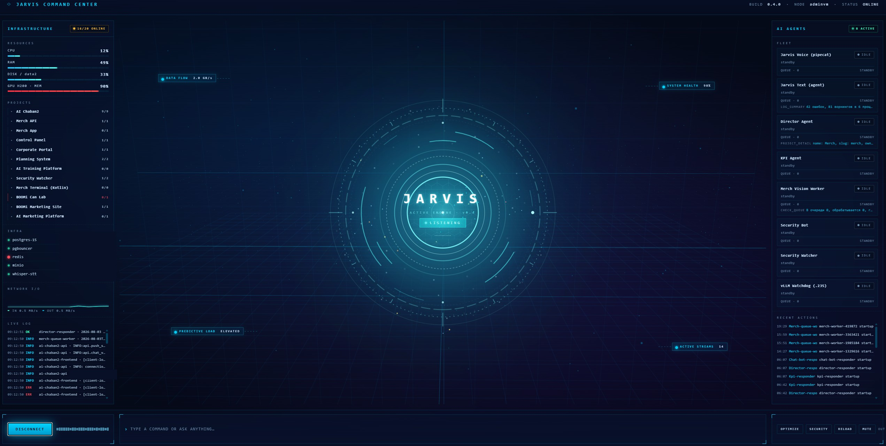
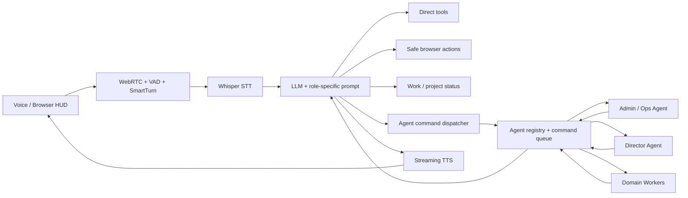

# Jarvis — Voice-First Multi-Agent Orchestrator & Executive Command Center

> A production-oriented voice command center that combines real-time WebRTC conversation,
> an agent registry and command queue, executive/project intelligence, safe browser actions,
> and delegated work across specialized AI agents.

> **Public case-study note:** production repositories and internal endpoints remain private.
> Infrastructure addresses, identities and company-specific access details are intentionally omitted.

*Jarvis Command Center: agent fleet state, project inventory, infrastructure/GPU telemetry and live
activity on one operational surface. Internal endpoints are redacted.*

## Problem

A normal voice assistant can answer questions, but it does not become an operational interface until
it can act on live systems safely.

The goal was to build a **voice-first orchestration layer** for two different users:

- a technical operator who needs infrastructure, service and deployment information;
- an executive who needs project status, risks, deadlines, blockers and business context without
  being exposed to low-level infrastructure details.

The harder problem was not speech recognition. It was giving the assistant enough authority to be
useful while keeping actions bounded, observable and attributable.

## What Jarvis does

Jarvis is both a **real-time voice assistant** and an **orchestrator over a fleet of specialized
agents**.

A user can speak naturally to the browser, ask for live project or operational information, ask
Jarvis to delegate a supported task to another agent, or tell it to open a named application/page.
The result is returned in voice-friendly form instead of exposing raw JSON or internal tooling.

### 1. Real-time voice interface

The conversational path is streaming rather than batch-oriented:

`WebRTC → Silero VAD / SmartTurn → Whisper STT → LLM → tool calls → streaming TTS → WebRTC`

The implementation uses **Pipecat + SmallWebRTC** for browser audio, local turn detection to avoid
cutting users off mid-sentence, and streaming TTS for a responsive conversational loop.

Jarvis supports separate **admin** and **director** profiles. The same voice engine can therefore
serve different personas while exposing different prompts and tool sets.

### 2. Multi-agent registry

Specialized agents register with Jarvis and publish operational state through a shared registry.
The registry tracks:

- agent identity and role;
- online / offline state via heartbeat;
- current task;
- queue depth;
- lifecycle and activity events.

This gives the HUD a live view of the agent fleet and lets Jarvis check whether a target agent is
available before delegating work.

### 3. Agent command orchestration

Jarvis can delegate supported work through a persistent command queue rather than calling arbitrary
agent code directly.

The command lifecycle is:

`pending → accepted → running → done | error | cancelled`

Before a command is queued, Jarvis checks the target agent's live status. Unknown or offline agents
are rejected early. The backend also enforces an **allowlist of agent + command combinations**, so a
voice prompt cannot turn into arbitrary remote execution.

Examples of delegated responsibilities include:

- **admin / operations agent:** system summary, service health, deployment status and fleet-wide log
  summary;
- **director agent:** project portfolio status, executive brief, risks, deadlines, blockers and
  project-detail summaries;
- **specialized workers:** bounded domain checks such as queue status for merchandising processing.

This is the important distinction from a conventional tool-calling bot: Jarvis can **assign work to
another agent, wait for its result and summarize the outcome back to the user**.

## Executive project intelligence

For the director profile, Jarvis acts as a voice interface over a structured portfolio registry.
The business-facing agent can return:

- portfolio status across the active project set;
- current risks grouped by severity;
- upcoming project and milestone deadlines;
- active blockers;
- detailed project cards;
- executive operational summaries;
- what the team is currently working on and the next step for an initiative.

The portfolio layer stores structured project metadata rather than relying on the LLM to remember
project status from conversation. That keeps executive answers grounded in current data.

## Safe browser control

Jarvis can also open internal products and dashboards from a voice request — for example project
pages, dashboards, merchandising, KPI, planning/forecasting or the operations control panel.

Browser control is intentionally **allowlisted by named target**. The LLM cannot supply an arbitrary
URL. Jarvis places an `OPEN_URL` action into the HUD action queue, and the browser executes the
approved target. This limits prompt-injection exposure while preserving a useful hands-free workflow.

## Command Center HUD

The browser UI is more than a microphone screen. It acts as a visual command center with:

- AI-agent fleet and per-agent state;
- project inventory and live work/activity;
- server / service health;
- PM2 process and log telemetry;
- GPU H200 utilization and memory telemetry;
- live voice state (`idle → listening → processing → speaking`);
- real-time log/activity surfaces;
- 3D / animated system visualization behind the operational HUD.

The goal is one surface where an operator can **see the system, talk to it and delegate work**.

## Role boundaries and safety

Jarvis deliberately does not expose the same authority to every persona.

The **admin profile** can use infrastructure tools and operational agents. The **director profile**
receives business/project capabilities while low-level infrastructure operations are intentionally
removed from its tool set.

Other safeguards include:

- tool results are treated as the source of truth for live numbers;
- unknown tools and unsupported commands fail closed;
- server-side agent-command allowlists;
- offline-agent checks before enqueueing work;
- named browser targets instead of arbitrary URLs;
- structured command status and persisted results/errors;
- short, role-appropriate summaries instead of raw tool payloads.

## Architecture

## My role

Designed and built the system across the voice pipeline and orchestration layers: WebRTC/Pipecat
integration, profile routing, tool design, agent registry, command dispatch, browser-action safety,
project/portfolio data access and the operational HUD.

The project evolved from a real-time voice assistant into a broader **agent control plane and
executive command interface**.

## Stack

`Python` · `FastAPI` · `Pipecat` · `WebRTC` · `Whisper` · `LLM tool calling` · `streaming TTS` ·
`PostgreSQL` · `agent registry` · `command queues` · `SSE` · `Three.js` · `PM2` · `NVIDIA H200`

## Engineering highlights

- **Voice as an interface, not the architecture:** speech is the entry point; the real value is the
  grounded tool/agent layer underneath it.
- **Multi-agent orchestration:** agent registry, heartbeat, queues, status transitions and delegated
  work with returned results.
- **Role-aware capabilities:** executive and technical personas share infrastructure while receiving
  different tool boundaries.
- **Safe browser actions:** voice navigation without arbitrary URL execution.
- **Grounded project intelligence:** project status, risks, deadlines and blockers come from
  structured live data, not model memory.
- **Operational observability:** the HUD exposes agents, projects, infrastructure, GPU and activity in
  one place.
- **Fail-closed delegation:** unknown/offline agents and unapproved commands are rejected instead of
  being improvised by the model.

## Result

Jarvis became a **voice-first multi-agent command center**: one interface can answer from live data,
open approved operational surfaces, query the project portfolio, delegate bounded tasks to
specialized agents and return the result conversationally.

That makes the project less about building another chatbot and more about building a practical
**human-to-agent orchestration layer for a production AI platform**.
