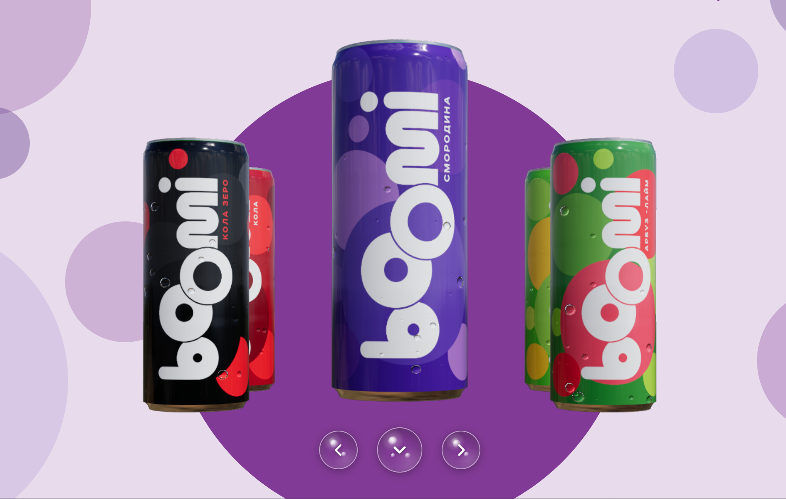
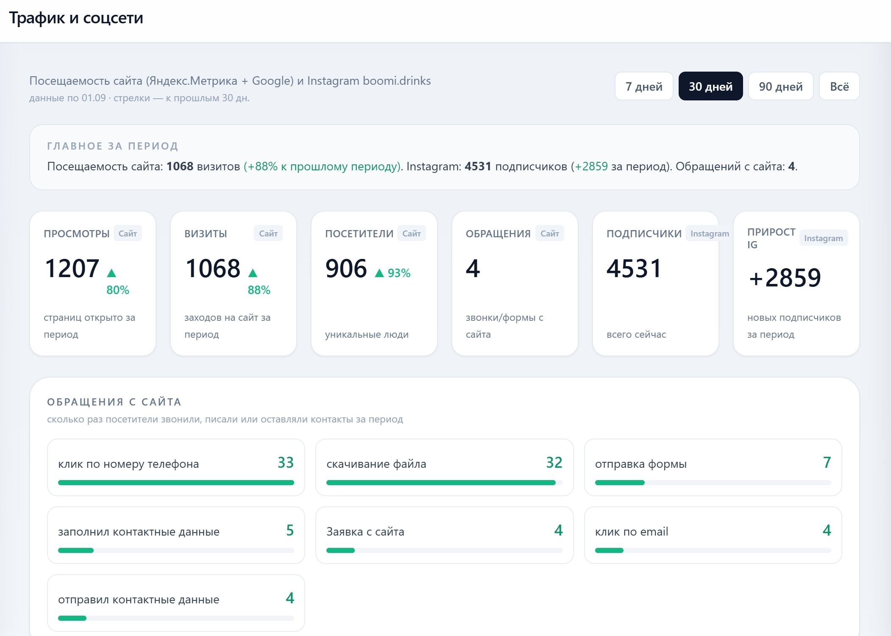
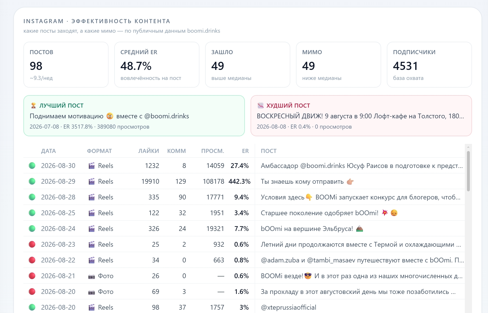
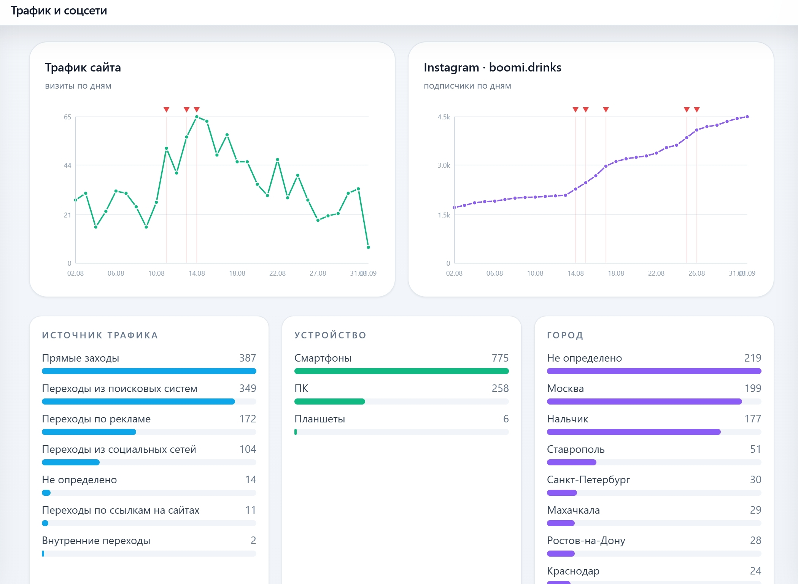
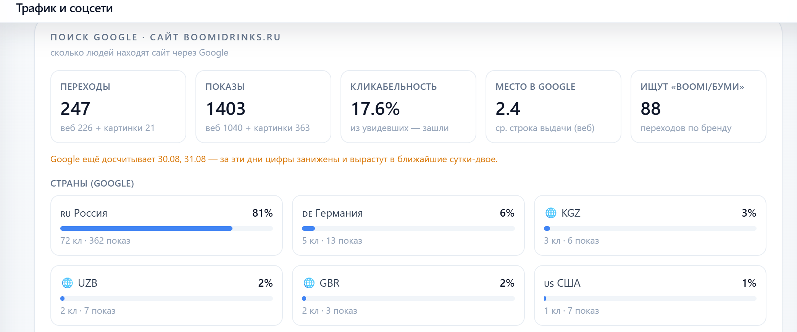

# AI Marketing & Brand Growth Platform

> A multi-source marketing intelligence platform for a consumer beverage brand — combining website traffic, Instagram analytics, search visibility, influencer workflow, campaign reporting and AI-assisted analysis.

## Problem

For a regional consumer-brand launch, the business needed more than a website and social posting. It needed a practical system to understand **where attention comes from, which content works, whether branded demand is growing, and which activities turn into measurable website actions**.

The goal was to replace disconnected reports and vanity metrics with one repeatable operational workflow for brand growth.

## Consumer-facing brand experience



The project also included the consumer-facing brand layer: an interactive 3D product experience built with Next.js and React Three Fiber, alongside generative-video workflows and programmatic social publishing.

## What the platform does

```text
content / campaigns / influencer activity
    → Instagram metrics collection
    → website analytics ingestion
    → search visibility analysis
    → campaign-period comparison
    → content effectiveness scoring
    → AI-assisted business reporting
```

The platform brings together three core data layers:

- **Social:** Instagram account growth, media/Reels performance, likes, comments, views and engagement.
- **Website:** traffic, visitors, acquisition sources, devices, geography and tracked lead/action events.
- **Search:** Google clicks, impressions, CTR, average position, branded demand, query-level intent and country distribution.

## Representative measured outcomes

From the showcased 30-day reporting window:

- **1,068 website visits** — **+88%** vs. the previous comparable period.
- **906 unique visitors** — **+93%**.
- **4,531 Instagram followers** with **+2,859 followers added during the period**.
- **98 Instagram posts** analyzed at content level.
- **247 Google search clicks** from **1,403 impressions**.
- **17.6% Google Search CTR** and **2.4 average search position**.
- Website actions tracked at event level, including phone clicks, forms, downloads and contact actions.

These figures are presented as observed platform measurements, not as causal attribution of all growth to the software itself.

## Growth snapshot



The platform combines website traffic and Instagram growth in one reporting view, making period-over-period changes visible alongside tracked website actions.

## Content intelligence



The reporting layer evaluates individual posts rather than relying only on account-level averages. It tracks:

- publication date and format,
- likes and comments,
- views,
- engagement rate,
- relative performance,
- best / worst content for the measured period.

This allows the team to move from “we posted a lot” to **which content actually generated attention**.

## Traffic attribution & audience



Website analytics are normalized into the same reporting layer as social growth. The platform exposes:

- direct traffic,
- organic search,
- advertising traffic,
- social referrals,
- external links,
- daily traffic trends,
- device distribution,
- city-level geography.

Campaign dates and brand activities can then be reviewed alongside actual traffic and follower movement.

## Search visibility



The search layer exposes clicks, impressions, CTR, average position, branded demand and country-level distribution from Google Search Console data.

Search visibility becomes a measurable **brand-intent signal**, not a black box.

## Architecture

```text
Instagram Business / Graph API
    → account growth
    → media / Reels metrics
    → post-level content performance

Yandex Metrika
    → visits / users
    → traffic sources
    → goals / website actions
    → devices / geography

Google Search Console
    → clicks
    → impressions
    → CTR
    → average position
    → query-level demand
    → country breakdown

Influencer / campaign workflow
    → discovery
    → authenticity filtering
    → campaign-period comparison

Analytics layer
    → trend deltas
    → best / worst content
    → spike detection
    → cross-channel reporting

AI-assisted analysis
    → metric interpretation
    → structured summaries
    → business-facing reports
```

## Influencer workflow

The wider marketing workflow also includes local micro-influencer discovery and vetting:

- discovery from regional hashtags and context signals,
- follower-band and engagement filtering,
- comment-authenticity analysis,
- ranked shortlists for human review.

A broad pool of approximately **970 candidate accounts** was reduced to about **30 qualifying profiles** and a vetted shortlist of around **19 genuine micro-influencers**.

## My role

I designed and implemented the marketing-intelligence layer, including:

- external API/data integration,
- Instagram Business / Graph API operations,
- website and search analytics aggregation,
- campaign reporting logic,
- content effectiveness analysis,
- influencer discovery / vetting workflow,
- AI-assisted analysis and business reporting.

Adjacent work included the brand's **Next.js / React Three Fiber 3D web experience**, generative-video workflow and programmatic Instagram publishing.

## Stack

`Python` · `FastAPI` · `Instagram Business / Graph API` · `Yandex Metrika API` · `Google Search Console API` · `Apify` · `Next.js` · `React Three Fiber` · `generative video` · `marketing analytics` · `AI-assisted reporting`

## Engineering highlights

- **Multi-source unification:** website, social and search signals brought into one operational system.
- **Content intelligence:** individual posts are measured and compared instead of reporting only follower counts.
- **Search-demand layer:** branded and non-branded intent exposed through real queries and ranking data.
- **Cheaper-first influencer funnel:** expensive extraction runs only after inexpensive filters reduce the candidate pool.
- **Authenticity over vanity metrics:** follower counts and engagement rates are treated as insufficient on their own.
- **AI-assisted, human-reviewed:** AI accelerates interpretation and reporting without making uncontrolled marketing decisions.

## Related work

- [BOOMi — 3D Web, Generative Video & Social Integration](boomi.md)
- [Social Media Intelligence & Campaign Analytics](social-media-intelligence.md)

Those pages document adjacent components in more detail; this page is the integrated **marketing-platform portfolio case study**.