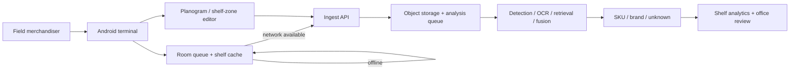

# Offline Merchandising Terminal — Field Capture for Shelf Intelligence

> A private native Android field application that turns in-store shelf work into a durable offline-first capture workflow for the production merchandising AI pipeline.

> **Public case-study note:** production repositories, internal endpoints, store/user identifiers and company-specific deployment details are intentionally omitted. The implementation remains private.

## Why this exists

The computer-vision pipeline is only useful if field users can reliably create the input data.
Retail work happens in shops with inconsistent connectivity, interruptions, device restarts and repeated photo capture. A design that requires a stable connection before every photo would make the AI system operationally fragile even if the GPU pipeline itself were excellent.

The terminal was therefore designed as a **field product around the AI system**, not as a thin camera wrapper.

The end-to-end workflow is:

```text
store → shelf / display → capture or planogram mode
→ persistent local queue
→ network-aware deferred upload
→ ingest API / object storage
→ async AI analysis
→ shelf / SKU / competitor analytics
```

## Native Android product

The application is built with **Kotlin + Jetpack Compose** and uses **Room** for durable local state.

Field workflows include:

- selecting a retail outlet and shelf/display;
- creating and editing shelf/display records;
- capturing a shelf photo directly from the relevant card;
- analysis vs. planogram capture modes;
- seeing per-shelf upload state from the local queue;
- retrying or deleting queued photos;
- continuing core capture work while connectivity is unavailable.

The important product decision is that **capture does not wait for inference**. A user can continue working while uploads and GPU processing happen asynchronously.

## Durable offline photo queue

Photos are persisted in a Room-backed queue before network delivery.

The queue is not only a list of pending files. It carries business context such as the selected shelf/display and capture type so the backend can reconstruct where each image belongs after delayed synchronization.

Operational behaviors include:

- queue state visible across stores;
- per-photo retry/delete;
- bulk “send all” flow;
- periodic background synchronization through **WorkManager**;
- immediate retry when the device transitions from offline to online;
- recovery of items left in an `UPLOADING` state if the process/device was interrupted mid-request.

That last case matters in real field software: without explicit recovery, a killed process can leave an item looking permanently in-flight and therefore invisible to ordinary retry logic.

## Network-aware synchronization

The application observes connectivity state rather than relying only on a fixed periodic job.

When the network returns:

```text
offline → online edge
→ trigger upload retry immediately
→ background worker drains pending queue
```

A periodic WorkManager sweep remains as a fallback if the connectivity transition is missed.

This gives the field user fast recovery after a weak-network interval without requiring a manual “sync” ritual.

## Offline shelf / planogram registry

Later versions extended offline behavior beyond the photo queue.

The shelf/display registry is cached locally in **Room**, allowing the application to show previously synchronized shelf structures when the API is unavailable. Cover images use disk caching, and data can be pre-warmed in the background when connectivity returns.

The application explicitly distinguishes operations that are safe offline from mutations that require a live server. That is preferable to pretending that every action succeeded locally and discovering conflicts later.

## Planogram workflow & on-device shelf zones

The terminal also supports a planogram-oriented workflow rather than treating every image as an undifferentiated analysis photo.

A field user can work through:

```text
store
→ shelf/display
→ planogram capture
→ shelf-zone annotation
→ synchronized shelf geometry
```

The Android UI includes an interactive shelf-zone editor with:

- drawing zones directly over the image;
- dragging existing regions;
- corner/edge resize handles;
- automatic numbering / ordering support;
- persistence through the merchandising API.

This moves part of data creation and correction to the person standing in front of the physical shelf, where the scene is easiest to understand.

## Relationship to the AI pipeline

The terminal is the **field edge** of the larger merchandising system.



The production recognition path is documented separately in the public **Retail Shelf Detection** technical case study.

→ **[Retail Shelf Detection — production retrieval & multimodal shelf intelligence](https://github.com/swd07/retail-shelf-detection)**

## Production engineering lessons

### Offline-first means durable state, not cached screens

A field app is not offline-ready because the last screen still renders without Wi-Fi. The important state is the work that must survive: captured media, business context and synchronization status.

### Process death is a normal failure mode

Mobile operating systems, weak networks and device restarts mean an upload can be interrupted at any point. Recovery logic therefore resets stale in-flight items into a retryable state.

### Separate capture from inference

GPU availability should never determine whether a merchandiser can take the next photo. Capture, upload and analysis are independent stages connected by durable queues.

### Put correction close to the source

Planogram/shelf-zone editing on the device allows structured shelf geometry to be corrected where the physical scene is visible instead of forcing all corrections into an office workflow.

## My role

As Technical Owner / platform architect for the broader commercial platform, I owned the merchandising-system architecture and production rollout. The Android terminal is part of that end-to-end system and was developed within the delivery team under the platform architecture; this case describes the product and engineering decisions I can substantiate rather than claiming every line of mobile implementation as individual authorship.

## Stack

`Kotlin` · `Jetpack Compose` · `Room` · `WorkManager` · `Android networking` · `Coil disk cache`  
`REST / JSON` · `object storage` · `async analysis queue` · `production CV / retrieval pipeline`

## Engineering principles demonstrated

- **Field reliability before model sophistication:** data capture must work under bad connectivity.
- **Durable local work:** persist the operation before attempting remote delivery.
- **Automatic recovery:** reconnect and process-death paths are expected states, not edge cases.
- **Asynchronous AI:** field UX is decoupled from GPU latency and availability.
- **Structured human input:** planogram/shelf-zone editing complements automated recognition where human context is stronger.
