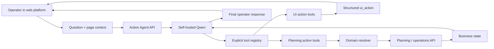

# Beverage Operations & Supply Planning Platform + Action Agent

> A private operational planning platform for a consumer beverage business — combining master data,
> supply planning, stock visibility, demand context, distribution workflows and an embedded
> self-hosted AI agent that can both navigate the interface and execute bounded planning actions.

> **Public case-study note:** the client/brand name, production hostnames, internal network addresses,
> user identities and company-specific commercial data are intentionally omitted. Production code
> remains private.

## Problem

Planning a beverage operation requires more than a static BI dashboard. Commercial and operations
teams need to work across product master data, trade/distribution entities, stock, demand forecasts,
production/supply plans and alternative planning scenarios.

The friction appears when an operator has to answer or execute questions such as:

- which planning scenario is currently selected;
- what supply quantity is planned for a specific product and sales entity;
- whether a month is calculated automatically or intentionally overridden;
- what the actual stock value should be for a planning period;
- how to compare only the metrics relevant to the current decision;
- where in a large planning matrix a particular product/month combination is located.

The goal was to make the operational platform easier to use without turning an LLM into an
unrestricted administrator.

## Operational platform

The broader private platform provides an operating layer around the beverage business, including:

- executive operational summary;
- product and operational master data;
- production / supply planning;
- stock and replenishment views;
- sales-demand / forecast context;
- distribution workflows;
- alternative planning scenarios;
- operational notes and analytical views.

The AI layer is embedded into this product rather than deployed as a separate generic chatbot.

## Embedded Action Agent

The assistant is a private **FastAPI + self-hosted Qwen** service connected to the operational UI.
It receives the user's question together with optional section/page context, chooses from an explicit
registry of tools and returns both natural-language output and structured UI actions.

A typical loop is:

`user intent → Qwen tool call → validated tool handler → planning API / UI action → tool result → final answer`

The server limits tool execution to a bounded number of rounds and falls back to a normal answer when
no further action is required.

## 11 bounded tools

The current action layer exposes **11 explicit tools**, split between planning mutations and UI
navigation/view operations.

### Planning actions

The agent can:

- switch a planning month between automatic and manual supply-plan mode;
- set a supply-plan quantity for a selected entity × SKU × month;
- reset a manual supply-plan override;
- set an actual-stock override for a selected period;
- reset an actual-stock override;
- mark a selected planning scenario as primary.

These are not free-form SQL or arbitrary HTTP requests. Each business action has a dedicated handler
that resolves domain entities and calls a predefined backend endpoint with a typed payload.

### UI actions

The same agent can manipulate the planning interface without changing business data:

- show or hide metric columns;
- leave only selected metrics visible;
- collapse or expand operational groups;
- scroll to a specific entity / SKU / month context;
- select a planning scenario.

The backend returns these as structured `ui_action` objects. The frontend decides how to render the
actual interface change.

This separation is useful because **“navigate the product for me”** and **“change the plan”** are two
different classes of intent even when both originate from natural language.

## Domain resolution before action

Users do not normally speak in database IDs, so the agent layer resolves human input before calling
business APIs.

Examples include:

- operational entity name → internal entity ID;
- product name / short name / SKU → canonical SKU ID;
- “May”, `05.2026` or `2026-05` → normalized planning period;
- natural metric names → the platform's canonical planning metrics.

Resolution includes ambiguity handling. If a partial name maps to several entities or SKUs, the tool
returns an explicit ambiguity result rather than silently choosing one.

## Security boundary: the model does not choose identity

One important production rule is that **user identity is injected by the server**, not trusted from
the model's tool arguments.

If an authenticated user ID is available, the orchestration layer overwrites/injects it into the tool
call before the handler executes. The model therefore cannot decide to call a data operation “as” a
different user simply by generating another identifier.

That design reflects a broader rule for tool-using agents:

> authorization context belongs to the application boundary, not to the language model.

## Anti-hallucination behavior

The system prompt explicitly instructs the assistant not to invent operational numbers. If a tool did
not return the required data, the correct response is to say that exact data is unavailable and point
the operator toward the relevant product section.

This is especially important in planning and operations: a fluent but invented quantity is worse
than no answer.

The model is therefore used for:

- intent understanding;
- choosing a known tool;
- filling a typed argument schema;
- summarizing the returned result;
- guiding the user through the product.

It is **not** the source of truth for quantities, stock or plan state.

## Architecture

## Example interaction patterns

### View-only assistance

`“Leave only forecast and supply-plan columns and take me to the June row for this SKU.”`

The agent can resolve the requested metrics and period and return structured interface actions without
mutating the underlying planning data.

### Bounded planning mutation

`“For this planning scenario, set the June supply quantity for Product X in Region Y to 4,000.”`

The tool resolves the operational entity and SKU, normalizes the month and calls only the dedicated
supply-plan override endpoint.

### Revert to automatic planning

`“Remove my manual override for June and return the month to automatic calculation.”`

The agent uses the explicit reset / mode tools instead of trying to reconstruct a generic update
request itself.

## Reliability & production behavior

The agent is deployed as its own service with health checks and process supervision. The production
runtime includes:

- bounded input length;
- bounded tool rounds;
- low-temperature model calls for operational predictability;
- graceful handling of malformed model/tool responses;
- explicit success markers when a plan was mutated;
- a separate list of UI actions returned to the frontend;
- fallback behavior for text-to-speech so voice assistance does not bring down the agent service.

The service uses a shared self-hosted Qwen inference layer rather than sending operational prompts to
an external hosted model by default.

## Why the action layer matters

Many enterprise “AI assistants” stop at retrieval and explanation. This system demonstrates the next
step: **an embedded agent that can operate a real business application through a narrow, auditable
capability surface**.

The useful boundary is not “LLM vs no LLM”. It is:

`free-form reasoning → explicit domain tool → deterministic application action`

That keeps natural-language interaction flexible while keeping the operational side constrained.

## My role

Designed and implemented the embedded action-agent layer, including the Qwen orchestration loop,
explicit tool registry, domain resolution, planning mutation tools, UI-action protocol, identity
injection, anti-hallucination rules, process/runtime behavior and integration with the surrounding
operations product.

The surrounding platform is a private commercial system; this case intentionally describes its
architecture and workflows without exposing client identity or proprietary commercial data.

## Stack

`Python` · `FastAPI` · `Pydantic` · `self-hosted Qwen` · `OpenAI-compatible inference` · `REST`  
`Next.js / React operational UI` · `PM2` · `Linux` · `tool calling` · `structured UI actions`

## Engineering principles demonstrated

- **Agent inside the workflow:** AI is embedded in the product users already operate.
- **Explicit capability surface:** every mutation maps to a predefined business tool.
- **Identity outside the model:** authorization context is injected by the server boundary.
- **Resolve before mutate:** names, SKUs, periods and metrics are canonicalized before action.
- **Ambiguity is an error state:** do not guess when multiple domain entities match.
- **Data is authoritative, language is not:** the model summarizes state returned by the platform.
- **Navigation and mutation are separate:** UI assistance does not automatically imply business-data
  modification.
