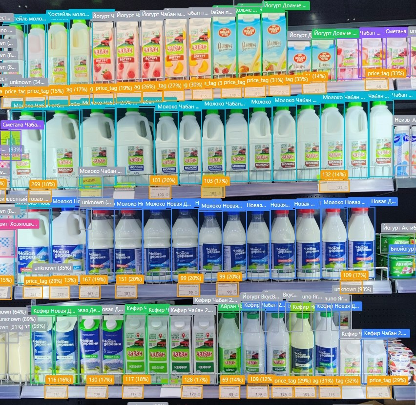
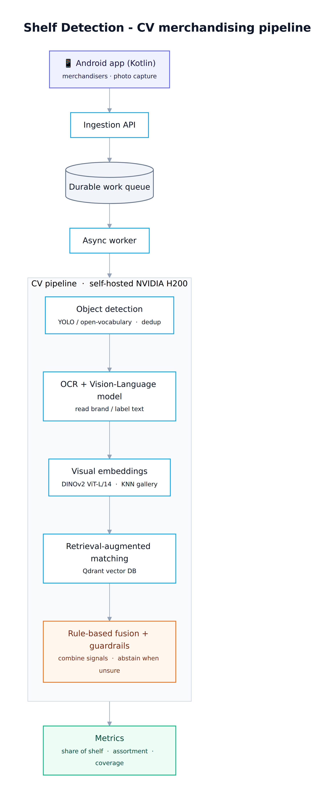

# Shelf Detection - Production Retrieval & Multimodal Shelf Intelligence

> A production computer-vision and retrieval pipeline that turns field-merchandiser shelf photos into structured share-of-shelf, assortment, and competitor analytics - with explicit uncertainty, measurable evaluation, and gated rollout.



*Live output on a real shelf: product boxes with brand/SKU labels, price-tag detections with read prices, and explicit `unknown` abstentions where evidence is insufficient.*

## Problem

Field representatives photograph retail shelves, and every detected product facing must be mapped to a catalog SKU so the business can measure:

- **share of shelf** (own brand vs. competitors),
- **assortment coverage**,
- **package / format / size mix**,
- **planogram and execution quality**.

The production catalog contains **1,345 SKUs** across own and competitor brands. The hard cases are visually similar siblings that differ only by weight, fat percentage, flavour, or package format. A wrong confident own-vs-competitor decision is worse than returning `unknown`, so the system is designed to abstain when evidence is insufficient.

## Architecture



The production path is fully self-hosted:

```text
mobile capture app
  -> ingestion API
  -> durable work queue
  -> async worker
  -> GroundingDINO detection
  -> Qwen2.5-VL OCR / package reading
  -> Qwen3-Embedding-8B
  -> Qdrant dense retrieval
  -> attribute-aware reranking
  -> DINOv2 visual k-NN
  -> fine-tuned ArcFace retrieval
  -> deterministic signal fusion
  -> evidence-based guardrails
  -> SKU / brand / unknown
  -> share-of-shelf and assortment metrics
```

The LLM **does not choose the final SKU**. It reads text and package evidence. Final identity is selected by an explainable decision pipeline that combines independent retrieval and visual signals.

## Retrieval pipeline

### Catalog representation

Each catalog SKU is represented as structured text combining attributes such as:

`brand + name + category + subcategory + flavour + fat% + weight + volume + package_type + visual_markers`

The text representation is embedded with a self-hosted **Qwen3-Embedding-8B** service.

### Dense retrieval

For each detected crop:

1. **Qwen2.5-VL-72B** reads the available OCR text.
2. The OCR query is embedded with **Qwen3-Embedding-8B**.
3. **Qdrant** searches the `nmk_products` catalog collection using cosine similarity.
4. The production retrieval depth is **top-20**.
5. A brand-filtered fallback can narrow the candidate set when OCR provides reliable brand evidence.
6. Candidates are reranked using product attributes such as fat percentage, weight, category, brand evidence, and own-brand protection rules.

The text embedding is **4096-dimensional and normalized**.

## Multimodal retrieval & fusion

Text retrieval is only one signal.

In parallel, the pipeline runs:

- **DINOv2 ViT-L/14** visual retrieval against an in-memory gallery of approximately **18.9k confirmed crops**;
- a fine-tuned **ArcFace** metric-learning encoder over approximately **9.1k reference crops**;
- OCR-derived brand and product-attribute evidence;
- package-form evidence for ambiguous product families.

A deterministic decision ladder combines these channels rather than letting one model make the final call.

Typical paths include:

```text
OCR brand + visual agreement
-> OCR brand + dense retrieval
-> strong dense retrieval
-> dense retrieval + visual agreement
-> visual retrieval
-> weak retrieval
-> unknown
```

Every prediction stores its decision path, scores, thresholds, and provenance so a wrong verdict can be reconstructed and debugged.

## Guardrails & honest uncertainty

The acceptance layer is deliberately conservative.

Examples of production guardrails include:

- **brand verification** against OCR evidence;
- **competitor protection** to reduce own/competitor confusion;
- **retrieval evidence gate** requiring independent OCR or ArcFace support for weak matches;
- **package-form guardrail** for bottle / canister / carton ambiguity;
- **ArcFace rescue** for cases where metric-learning evidence is stronger than the main visual path;
- **price-tag / promo rejection** to prevent non-product regions from entering product metrics;
- weight and sibling-product evidence where available.

Low-confidence cases become `unknown` instead of forced guesses.

Every guardrail supports a staged lifecycle:

```text
off -> shadow -> active
```

Candidate changes are measured in shadow before they can influence business metrics.

## Evaluation

Evaluation is treated as part of the production architecture, not as a one-time model benchmark.

The system uses:

- human-labelled golden sets;
- stratified evaluation by failure mode;
- cross-store validation to reduce leakage;
- distractor sets;
- **Recall@1 / Recall@5** for retrieval tracks;
- FPR-anchored precision calibration;
- Wilson confidence intervals for small stratified samples;
- pre-registered acceptance and kill thresholds;
- a **47k-box replay harness** that imports the production decision module;
- nightly regression tests;
- shadow tables for candidate models and guardrails.

This process has been used to **reject candidate rerankers and encoder replacements** when controlled evaluation showed that they would weaken production performance.

### Measured results

- **Brand precision: 95.8%** on the confirmed end-to-end golden set.
- **SKU precision: 73.1% end-to-end**, compared with approximately **29% for bare retrieval** before the full cascade and guardrails.
- Fine-tuned ArcFace cross-store **Recall@1: 84.1%**, versus **26.4% for the DINOv2 baseline** on the same retrieval benchmark.
- Human readability ceiling on the unresolved tail measured at **76.4% +/- 5.8 pp** under a blind, pre-registered protocol.
- Detection F1 improved from **0.68 -> 0.91** on unseen shelf photos during the detector track.

## Production usage

The system is live for merchandising and field-sales workflows:

- **1,345-SKU** catalog (own + competitor products);
- approximately **320k OCR calls** processed by the service;
- approximately **108k ArcFace shadow evaluations**;
- production worker + API + self-hosted inference services;
- cron monitoring and nightly regression checks;
- per-analysis provenance including code revision and configuration hash.

## Self-hosted AI stack

The production AI services run on owned **NVIDIA H200** infrastructure.

Core components:

- **Qwen2.5-VL-72B-AWQ** via vLLM for OCR / visual reading;
- **Qwen3-Embedding-8B** for text embeddings;
- **Qdrant** for vector retrieval;
- **DINOv2 ViT-L/14** for visual embeddings;
- **ArcFace** for fine-tuned metric retrieval;
- **GroundingDINO** for open-vocabulary detection;
- FastAPI services, PostgreSQL, MinIO / S3-compatible object storage, Docker, systemd / cron operations.

## My role

I designed and built the retrieval and matching architecture end-to-end: detector integration, OCR/VLM services, embedding service, Qdrant retrieval, attribute reranking, multimodal fusion, guardrails, evaluation harnesses, catalog-normalization tooling, and production rollout methodology.

I also built the evaluation discipline around the system: golden sets, replay testing, shadow deployment, kill criteria, and evidence-based promotion decisions.

## What this is - and is not

This is a **production retrieval-augmented recognition system**, not a classic document-question-answering RAG application.

The production pipeline uses vector retrieval and multimodal evidence to make an explainable SKU decision. The LLM does **not** receive retrieved documents and generate a grounded answer from them, and the production path does not expose document citations.

That distinction is intentional: for this business problem, deterministic fusion, independent evidence, and calibrated abstention provide stronger control than allowing an LLM to make the final identity decision.

## Stack

`Python` · `FastAPI` · `PyTorch` · `GroundingDINO` · `Qwen2.5-VL-72B` · `Qwen3-Embedding-8B` · `Qdrant` · `DINOv2` · `ArcFace` · `vLLM` · `PostgreSQL` · `MinIO / S3-compatible storage` · `Docker` · `NVIDIA H200`
